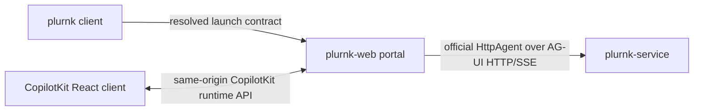

# plurnk-web specification

## Architecture

§web-client-boundary **`plurnk-web` is an AG-UI client, never a daemon.** It
owns browser presentation and a foreground local portal. `plurnk-service` owns
all durable runtime state and executes every operation.

| Component | Owned responsibility |
|---|---|
| PLURNK client | Environment cascade, workspace and Worker selection, model, reasoning, LoopPolicy, capabilities, proposal behavior |
| Browser application | CopilotKit chat/run UX, multiline input, review controls, PLURNK semantic renderers |
| Local portal | Host/port, static assets, local admission perimeter, CopilotKit runtime bridge, daemon credential |
| PLURNK daemon | Workspaces, Workers, Runs, log, policy, execution, accounting, model lifecycle |

§web-one-wire **The daemon's public AG-UI+ endpoint is the sole runtime
interface.** CopilotKit's official `HttpAgent` carries normal messages,
standard interrupt resumes, and namespaced management actions as
`RunAgentInput` over HTTP/SSE. The portal adds no PLURNK runtime RPC and does
not translate PLURNK state outside that public event stream.

§web-copilot-projection The CopilotKit runtime is a presentation bridge, not a
second agent runtime. Its bounded in-memory Runner retains only disposable
active-Run state. A same-process reconnect observes that Run through the stock
CopilotKit path. Otherwise, the Runner starts an inference-free AG-UI
synchronization Run and renders the daemon's authoritative
`MESSAGES_SNAPSHOT`; it never becomes durable truth, executes a model, or owns
a tool.

§web-state-authority **Browser storage is never runtime authority.** A reload
reattaches using daemon discovery, replay, and log actions. Browser storage may
retain only presentation preferences and the names of the last selected
workspace and Worker.

## Invocation and configuration

§web-invocation `plurnk web` is the sole product invocation. The canonical
PLURNK client parses and resolves its ordinary configuration, dynamically loads
the optional `@plurnk/plurnk-web` package, starts one foreground portal, prints
its URL, and remains attached to the terminal until interrupted. It does not
download the package, start the daemon, or open a listener other than the local
portal.

| Module input | Ownership |
|---|---|
| `host`, `port` | Web-owned listener configuration; only a loopback host is admitted |
| `upstream`, `token` | Client-resolved daemon target; the token remains inside the portal |
| `session` | Client-resolved `{workspace, threadId}` identity |
| `runProperties` | Opaque properties merged into `forwardedProps.plurnk` on each user Run |
| `autoAcceptProposals` | Resolved client proposal behavior; never applies to user-input interactions |

The web module owns no parallel environment cascade and no copy of the client's
configuration schema. The host client has already applied its normal cascade
before the module is loaded. `PLURNK_WEB_HOST` and `PLURNK_WEB_PORT` are the only
web-owned environment values. The source checkout's `npm run dev` command is a
private development runner that creates an anonymous cwd workspace; it is not a
second product client.

## Local security perimeter

§web-local-perimeter The default portal is deliberately local:

- only loopback bind addresses are accepted;
- `Host` must name the bound local origin;
- a supplied `Origin` must exactly match that origin;
- mutation uses same-origin `POST` only;
- browser assets receive a restrictive Content Security Policy;
- daemon authorization is added by the portal and never serialized into an
  asset, URL, response, or browser-readable bootstrap value;
- browser authorization and `x-*` headers are not forwarded to the daemon;
- CopilotKit and browser assets are bundled rather than loaded from a CDN.

Non-loopback service is not a relaxed flag on this contract. A remotely exposed
portal needs a separately specified authentication and admission perimeter.

## Browser session

§web-session One client-resolved workspace and conversation Worker define the
active browser session. The workspace is the AG-UI world and the Worker is the
CopilotKit thread. The portal neither invents nor re-resolves either identity.
Reload and reconnect use that same durable daemon identity.

§web-run A user prompt produces an official AG-UI Run. The browser consumes:

| Semantic | Wire representation |
|---|---|
| Run lifecycle | `RUN_STARTED`, `RUN_FINISHED`, `RUN_ERROR` |
| Reattach | `MESSAGES_SNAPSHOT` |
| PLAN | `ACTIVITY_SNAPSHOT` with `activityType: "PLAN"` |
| Reasoning | standard `REASONING_*` lifecycle |
| Operations | standard tool calls plus full `CUSTOM plurnk.row` projection |
| Speech | standard text-message lifecycle |
| Gauge | `STATE_SNAPSHOT` and `STATE_DELTA` |
| Exact failures and notices | `CUSTOM plurnk.problem`, `CUSTOM plurnk.notice` |
| Terminal accounting | `CUSTOM plurnk.terminated` |

§web-reattach Browser connection is a request for current conversation truth,
not permission to infer. If the portal has no active in-memory Run for the
selected thread, its Runner sends an empty AG-UI Run with
`forwardedProps.plurnk.mode = "sync"`. The daemon replays durable messages,
re-presents a pending interrupt, observes independently-owned live work, or
finishes immediately when idle. Reloading the browser or restarting the portal
therefore creates no prompt, turn, or model request.

§web-interrupt Client-owned proposals and interactions use standard AG-UI
interrupt outcomes and `RunAgentInput.resume`. The browser never calls a private
resolution endpoint or reconstructs proposal ownership from operation traits.

§web-cancellation Cancelling aborts the active AG-UI Run. The daemon remains
the owner of cancellation and its resulting terminal truth.

## Presentation

§web-presentation The browser presents PLURNK as a structured operation log,
not a flattened transcript. CopilotKit owns generic text, reasoning, tool, and
run presentation. Small PLURNK renderers preserve PLAN, status and budget,
Problems and Notices, and standard interrupt controls as distinct semantics.
Host-native responsive layout may differ from terminal and Neovim without
changing their meaning.

Markdown rendering does not execute embedded HTML. Browser assets are bundled;
there are no runtime CDN fetches.

## Composition and verification

§web-composition The package is verified in its packed form. Production tests
install packed client and web artifacts together, launch `plurnk web`, load
built assets, and drive the official AG-UI client through the portal against a
real listener. Source-only or development-server success is insufficient.

The terminal client imports only the package's server-side launch function; it
does not import browser presentation code. The launch function accepts resolved
runtime values rather than a second client configuration representation.
