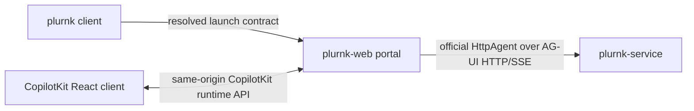

# plurnk-web specification

## Architecture

§web-client-boundary **`plurnk-web` is an AG-UI client, never a daemon.** It
owns browser presentation and a foreground local portal. `plurnk-service` owns
all durable runtime state and executes every operation.

```mermaid
flowchart LR
    Client[plurnk client] -->|resolved launch contract| Portal[plurnk-web portal]
    Browser[CopilotKit React client] <-->|same-origin CopilotKit runtime API| Portal
    Portal -->|official HttpAgent over AG-UI HTTP/SSE| Daemon[plurnk-service]
```

| Component | Owned responsibility |
|---|---|
| PLURNK client | Environment cascade, optional workspace/Worker constraints, workspace-create and Run properties, model, reasoning, LoopPolicy, capabilities, prompt projection, timeout, proposal behavior |
| Browser application | URL-addressed workspace/Worker selection, CopilotKit chat/run UX, multiline input, review controls, lazy MCP management, PLURNK semantic renderers |
| Local portal | Host/port, static assets, route enforcement, local admission perimeter, CopilotKit runtime bridge, daemon credential |
| PLURNK daemon | Workspaces, Workers, Runs, log, policy, execution, accounting, model lifecycle, resource configuration and publication |

§web-one-wire **The daemon's public AG-UI+ endpoint is the sole runtime
interface.** CopilotKit's official `HttpAgent` carries normal messages,
standard interrupt resumes, and namespaced management actions as
`RunAgentInput` over HTTP/SSE. The portal adds no PLURNK runtime RPC and does
not translate PLURNK state outside that public event stream.

§web-copilot-projection The CopilotKit runtime is a presentation bridge, not a
second agent runtime. Its bounded in-memory Runner retains only disposable
active-Run state. A same-process reconnect observes that Run through the stock
CopilotKit path. Otherwise, the Runner starts an inference-free AG-UI
synchronization Run and renders the daemon's authoritative
`MESSAGES_SNAPSHOT`; it never becomes durable truth, executes a model, or owns
a tool.

§web-state-authority **Browser storage is never runtime authority.** The URL
names the selected workspace and Worker; a reload reattaches using daemon
discovery, replay, and log actions. Browser storage may retain presentation
preferences only.

## Invocation and configuration

§web-invocation `plurnk web` is the sole product invocation. The canonical
PLURNK client parses and resolves its ordinary configuration, dynamically loads
the optional `@plurnk/plurnk-web` package, starts one foreground portal, prints
its URL, and remains attached to the terminal until interrupted. It does not
download the package. Backend selection and any private daemon startup remain
the canonical client's responsibility; the web module opens only its portal.

| Module input | Ownership |
|---|---|
| `host`, `port` | Web-owned listener configuration; only a loopback host is admitted |
| `upstream`, `token` | Client-resolved daemon target; the token remains inside the portal |
| `constraints` | Optional client-resolved workspace and Worker constraints |
| `workspaceProperties` | Client-resolved create-time properties used for every selected workspace |
| `runProperties` | Opaque properties merged into `forwardedProps.plurnk` on each user Run |
| `prepareSession` | Client-owned application of explicit durable model and reasoning selections |
| `projectPrompt` | Canonical client projection of prompt prefixes and referenced paths into prompt text plus per-Run properties |
| `timeoutSec` | Client-resolved deadline; the portal cancels the exact session through `loop.cancel` |
| `autoAcceptProposals` | Resolved client proposal behavior; never applies to user-input interactions |

The web module owns no parallel environment cascade and no copy of the client's
configuration schema. The host client has already applied its normal cascade
before the module is loaded. MCP configuration remains daemon-owned; no client
environment overlay is sent through discovery or browser bootstrap.
`PLURNK_WEB_HOST` and `PLURNK_WEB_PORT` are the only web-owned
environment values. The source checkout's `npm run dev` command is a private
development runner that supplies cwd workspace-create properties to an
otherwise unconstrained portal; it is not a second product client.

The module loads its packaged `.env.defaults` and the shared contracts panel
set-if-unset. Listener and telemetry defaults have no fallback literals in
code. The development runner's daemon URL derives from the shared
`PLURNK_HOST`/`PLURNK_PORT` unless `PLURNK_AGUI_URL` is explicit; it neither
redefines the daemon's address nor changes the product client's cascade.

§web-client-projection Every workspace create and prompt Run identifies the
browser frontend as `@plurnk/plurnk-web/<version>`, regardless of which terminal
client loaded the module. Create-time settings, capability ceilings, model and
reasoning selections, base LoopPolicy, prompt-derived policy, `@path`
references, turn limits, timeout, and yolo behavior retain
the canonical client's interpretation. Terminal-only output and state-query
options have no browser projection.

## Local security perimeter

§web-local-perimeter The default portal is deliberately local:

- only loopback bind addresses are accepted;
- `Host` must name the bound local origin;
- a supplied `Origin` must exactly match that origin;
- mutation uses same-origin `POST` only;
- browser assets receive a restrictive Content Security Policy;
- daemon authorization is added by the portal and never serialized into an
  asset, URL, response, or browser-readable bootstrap value;
- browser authorization and `x-*` headers are not forwarded to the daemon;
- CopilotKit and browser assets are bundled rather than loaded from a CDN.

Non-loopback service is not a relaxed flag on this contract. A remotely exposed
portal needs a separately specified authentication and admission perimeter.

## Browser session

§web-session **Every ready browser URL is
`/<workspace>/<threadId>`.** The first coordinate names the AG-UI world and the
second names its conversation Worker. Missing unconstrained coordinates are
generated and redirected to a complete URL before the application is served.
A configured workspace or Worker fixes only its respective coordinate. Thus an
unconstrained portal may host many worlds and conversations; a workspace-locked
portal may host many conversations in that world; and a fully constrained
portal exposes one pair. A duplicated complete URL observes the same durable
Worker.

The browser discovers existing choices through `workspace.list` and
`workspace.workers`, and uses the ordinary AG-UI creation/attachment path for
new choices. Workspace resolution always precedes Worker resolution. Browser
storage contributes no identity. CopilotKit's process-local bookkeeping uses a
collision-free pair key, while AG-UI receives the real workspace and Worker as
separate coordinates.

§web-topology **The Worker selector is the workspace's worker topology.** The
portal forwards the `workspace.workers` rows (`name`, `origin`, `parentWorkerId`,
`createdAt`) in `bootstrap.json` beside the name list, and the browser renders the
selector's options as a forest from `parentWorkerId`: the bound conversation's
tree first and marked `●`, tree connectors in the labels, a worker whose parent is
not in the directory standing as a root, an unminted thread as a plain root.
Siblings are newest first. Selection remains URL navigation to
`/<workspace>/<name>`; "New Worker" remains the mint. The map carries no lifecycle:
a worker's state is seen by being in it.

§web-topology-hops **Topology is navigation, not a dashboard.**
A child worker is a first-class place the session goes to, prompts, forks, or
opens as the root of another session. `Alt-h` climbs to the parent, `Alt-l`
enters the newest child, `Alt-j`/`Alt-k` walk older/newer siblings and wrap —
vim's tree orientation, depth horizontal and siblings vertical — and each hop is
the same URL navigation as selecting the worker, never a read-only visit; the
composer then speaks to that worker. Places are conversations and their
descendants; the daemon's and a connection's scratch workers are never targets.
An edge shows why nothing moved (`(at the root: no parent)`, `(no children)`,
`(no siblings)`). The navigation shows the lineage from the tree root to the
bound worker with `~` marking the worker the session is in:
`[/~main]` at a root, `[/main/fork-1/~recheck]`
two hops down; a child always shows that it is a child — followed by the sibling
position `(2/3)` when there is one; nothing is inferred from row coordinates. The status bar's ant, `🐜<n>`, is the daemon's
`status.children` — the bound worker's alive direct children (queued, running,
parked) — and is absent when the daemon states none; the browser never polls the
directory for it. Live descendant supervision is this navigation plus the ant,
not a lane projection.
§web-run A user prompt produces an official AG-UI Run. The browser consumes:

| Semantic | Wire representation |
|---|---|
| Run lifecycle | `RUN_STARTED`, `RUN_FINISHED`, `RUN_ERROR` |
| Reattach | `MESSAGES_SNAPSHOT` |
| Notes | Ordinary NOTE tool calls and `CUSTOM plurnk.row`; not assistant speech or synthetic Plan activity. |
| Reasoning | standard `REASONING_*` lifecycle |
| Operations | standard tool calls plus full `CUSTOM plurnk.row` projection |
| Speech | standard text-message lifecycle for delivered SEND and parameterless KILL bodies, independently of workflow settlement |
| Gauge | `STATE_SNAPSHOT` and `STATE_DELTA` |
| Exact failures and notices | `CUSTOM plurnk.problem`, `CUSTOM plurnk.notice` |
| Terminal accounting | `CUSTOM plurnk.terminated` |

Before forwarding a prompt, the portal applies the canonical client's prompt
projector. The resulting text is the daemon prompt, while its dynamic policy
and `openPaths` override the base Run properties. A configured timeout applies
only to prompt Runs; expiry sends `loop.cancel {reason:"client_timeout"}` for
the exact workspace/Worker and leaves the durable conversation available for
reattachment. Management actions, synchronization Runs, and interrupt resumes
do not start independent prompt deadlines.

§web-reattach Browser connection is a request for current conversation truth,
not permission to infer. If the portal has no active in-memory Run for the
selected thread, its Runner sends an empty AG-UI Run with
`forwardedProps.plurnk.mode = "sync"`. The daemon replays durable messages,
re-presents a pending interrupt, observes independently-owned live work, or
finishes immediately when idle. Reloading the browser or restarting the portal
therefore creates no prompt, turn, or model request.

§web-interrupt Client-owned proposals and interactions use standard AG-UI
interrupt outcomes and `RunAgentInput.resume`. The browser never calls a private
resolution endpoint or reconstructs proposal ownership from operation traits.

§web-cancellation Cancelling aborts the active AG-UI Run. The daemon remains
the owner of cancellation and its resulting terminal truth.

§web-mcp-management MCP management projects the daemon's workspace-scoped
Functionality contract through ordinary AG-UI actions. Shared contract schemas
validate responses before rendering; malformed responses are errors, not empty
catalogs. The browser neither parses MCP configuration nor connects to servers.

| Interaction | Action and interpretation |
|---|---|
| Open or refresh manager | `workspace.mcp.list`; inspect without discovery or activation |
| Search MCP Registry | Explicit `workspace.mcp.discover {query}`; candidates remain inert |
| Add candidate | `workspace.mcp.add` with its exact definition and alias; create a workspace override, not a plugin installation |
| Enable or disable | `workspace.mcp.enable` or `.disable {alias}`; only `state=disabled` is disabled. Dormant, unavailable and authorization-required remain enabled. |
| Remove | `workspace.mcp.remove {alias}` for workspace-owned definitions; inherited configuration resumes under the daemon's cascade |
| Present | Alias, state, transport type, ownership, available tool count, exact Problem and authorization link; no host executable path or environment dump in the summary |

No MCP configuration enters the portal launch contract or browser bootstrap.
The portal preserves management payloads without injecting configuration.

## Presentation

§web-presentation The browser presents PLURNK as a structured operation log,
not a flattened transcript. CopilotKit owns generic text, tool, and run
presentation. Small PLURNK renderers preserve reasoning, status and
budget, Problems and Notices, and standard interrupt controls as distinct
semantics. Reasoning content is escaped plaintext in a fixed-width,
whitespace-preserving projection; it is never interpreted as Markdown or HTML.
Host-native responsive layout may differ from the terminal without
changing their meaning.

Markdown rendering does not execute embedded HTML. Browser assets are bundled;
there are no runtime CDN fetches.

## Composition and verification

§web-release The web client retains its independent version line. Its contracts
dependency declares the supported platform range; `plurnk.builtAgainst` records
the platform verified in composition. A platform release checks that compatibility
without restamping or publishing the web client as a managed extension.

§web-composition The package is verified in its packed form. Production tests
install packed client and web artifacts together, launch `plurnk web`, load
built assets, and drive independently addressed browser sessions through the
official AG-UI client against a real listener. The gate supplies workspace,
Worker, proposal, and portal values through the normal environment cascade and
asserts the resulting route constraints, create-time properties, browser
frontend identity, durable model and reasoning actions, prompt-derived policy
and referenced paths, deadline cancellation, and unchanged MCP management
actions. Browser action tests cover exact definitions, readiness, mutations and
configuration failures over HTTP/SSE.
Source-only or development-server success is insufficient.

The terminal client imports only the package's server-side launch function; it
does not import browser presentation code. The launch function accepts resolved
configuration and navigation values rather than a singleton session or a
second client configuration parser.
