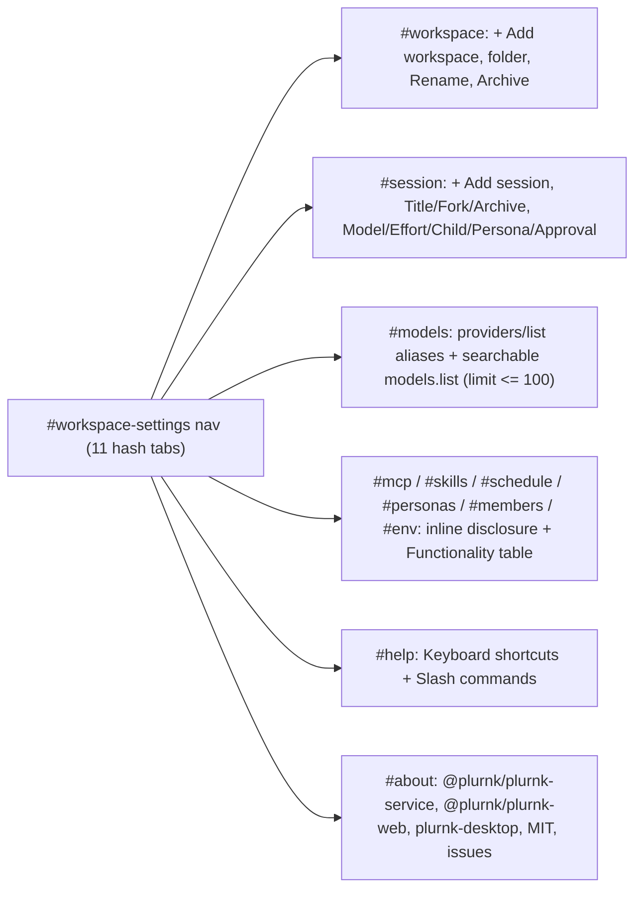
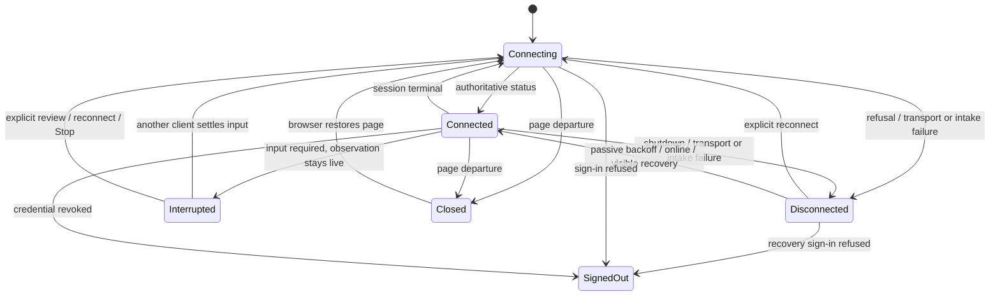

# Web module

## §web-host Hosting

`@plurnk/plurnk-web` ships as an `optionalDependencies` leaf of
`@plurnk/plurnk-service`, and `@plurnk/plurnk-web/module` exports one native
Plurnk module composed by the service when installed. It uses the public module
lifecycle and HTTP registration seam, never a separate listener or process. The
daemon owns composition, routing precedence, startup readiness and shutdown.

| Installation | Behavior |
|---|---|
| `@plurnk/plurnk-web` installed (default) | Claim and register `/` on the daemon's existing listener. |
| Omitted (`npm install --omit=optional` or `npm uninstall @plurnk/plurnk-web`) | Absent from the daemon's module composition; `/` remains unclaimed. |

More-specific mounts retain their ownership.

## §web-route-settlement Shutdown admission and settlement

| Boundary | Contract |
|---|---|
| Stop | Refuse every new request to the module's mount with a private 503 `service-stopping` Problem, before accessing credential verification or asset/diagram resources. HEAD omits the body. Already admitted requests remain owned until their handlers settle, even if the browser disconnects. |
| Close | Stop admission, cancel diagram compilation, join all admitted handlers, then release development asset resources. Close also works without a preceding stop or completed startup. |
| Failure | Unexpected handler errors still reject to the HTTP host; joining them does not turn them into success. A cleanup failure does not skip request settlement or subsequent resource cleanup. |
| Host | The daemon owns transport teardown and the overall shutdown deadline. Web adds neither a request-body deadline nor a separate shutdown timeout. No web request may reach host resources after close returns. |

## §web-configuration Configuration boundary

| Boundary | Contract |
|---|---|
| Module choices | `.env.defaults` declares project-folder workspace creation policy (`PLURNK_WEB_ALLOW_PROJECT_FOLDER`), search/overview session and reply-excerpt bounds (`PLURNK_WEB_OVERVIEW_SESSIONS`, `PLURNK_WEB_OVERVIEW_EXCERPT_CHARS`), and diagram compilation limits (`PLURNK_WEB_DIAGRAM_*`). Optional `PLURNK_ACP_URL` selects an external `http(s):` `/acp` endpoint (trimmed; empty or omitted uses same-origin `/acp`). Boot values (`data-acp-url`, `data-allow-project-folder`, `data-overview-sessions`, `data-overview-excerpt-chars`, `data-web-version`) are stamped as `data-*` attributes on `<html>` with no inline `<script>`. |
| Invalid input | Invalid web settings (including malformed `PLURNK_ACP_URL`) are reported in `module.contained` and withhold only the part each configures (503 when requested), leaving the rest of the module operational. Missing floor values remain an internal deployment error; neither condition silently selects a replacement value. |
| Pure ACP seam | The Node module registers only `/` static shell/assets (`registerHttpRoute`) and optional bearer token verification (`credentials.face()` + `credentials.verify(token)`) for `POST /render/mermaid`. It never calls daemon workspace or session backdoor methods on `ApplicationPort`. |
| Browser | Connects directly to `/acp` and `/notifications` on the configured ACP origin (`web/endpoints.js`). Vite compiles assets independently of operator configuration. |

## §web-arrival Client arrival

| Request | Resolution |
|---|---|
| `GET /` (`data-page="home"`) | Serves the static arrival shell; on `/`, browser JavaScript queries `session/list` (`archived: "exclude"`) on `/acp`, selects the most recently active non-draft unarchived root model session (falling back to any non-draft unarchived model session, then any unarchived model session), and replaces the location (`location.replace`) with `/~/<workspace>#<session>`. |
| Zero unarchived model sessions on `/acp` | Reuses an existing unarchived workspace (`workspace.list` + `workspace.sessions`) or allocates one sequential folderless workspace (`workspace.create` `{ name: "workspace1", projectRoot: null }`, retrying on `409`), creates its starter `session1` (`session/new`), and calls `location.replace("/~/<workspace>#session1")`. |
| `GET /index.html` or standalone Vite dev | Serves the static root shell without issuing `/acp` arrival mutations or touching browser storage. |

## §web-assets Static resources

| Request | Response |
|---|---|
| GET `/` | Home document rendered from the packaged HTML; authenticated header controls follow {§web-page-shell}. |
| GET `/index.html` | Same root document. |
| GET `/assets/<build-generated-name>` | Compiled browser JavaScript and CSS. |
| GET `/manifest.webmanifest` | Web app manifest (`application/manifest+json`). |
| GET `/icons/plurnk.svg` | Scalable app icon. |
| GET `/icons/plurnk-maskable.svg` | Maskable app icon. |
| GET `/icons/NOTO-NOTICE.txt`, `/icons/APACHE-2.0.txt` | Artwork attribution and license. |
| GET `/vendor/OTM-LICENSE.txt`, `/vendor/DEPENDENCIES-LICENSE.txt` | Packaged substrate and bundled JavaScript dependency licenses. |
| GET `/vendor/<PACKAGE>-LICENSE.txt` | The license text of a bundled package whose npm artifact omits it, retained from the package's published git revision and named for the package (`@scope/name` as `SCOPE-NAME`, uppercase); its `DEPENDENCIES-LICENSE.txt` entry is a heading only. |
| HEAD on any served path | Same status and headers as GET, without a body. |
| Other asset path | 404 error document, never a home-page fallback or filesystem listing. |
| Asset method other than GET/HEAD | 405 with `Allow: GET, HEAD`. |

Query strings do not select assets. Paths select the build-generated asset inventory, never
filesystem paths derived from the request. Only packaged public assets are served;
configuration, source, credentials and workspace files are not public resources.
Assets are loaded during module startup: missing package bytes fail startup rather
than leaving a partially functioning page. Responses declare their media type,
byte length and `X-Content-Type-Options: nosniff`.

## §web-asset-encoding Static content encoding

| Boundary | Contract |
|---|---|
| Build | Retain each original asset. For non-HTML assets, package Brotli and gzip representations only when smaller than the original. The inventory names those representations; compression runs at build time, not startup or per request. |
| Address | All representations share the original URL and media type. Encoded files are inventory implementation details, not additional public URLs. Every declared representation must load before route registration. |
| Negotiation | Use standard `Accept-Encoding` negotiation, honoring quality weights, explicit exclusions, wildcards and identity. Among equally acceptable representations prefer the smallest. An absent or empty header selects identity; no acceptable representation yields 406. |
| Headers | Add `Accept-Encoding` to `Vary`, preserving existing fields; `Content-Encoding` only for encoded representations; `Content-Length` is the selected representation's byte length. HEAD selects the same representation and headers as GET but sends no body. No new cache lifetime is introduced. |
| Scope | Dynamic/private documents, authentication responses and other daemon mounts, including ACP streams, are not compressed by this handler. Their existing security, caching and streaming contracts remain unchanged. |

Reference: [HTTP content negotiation](https://www.rfc-editor.org/rfc/rfc9110.html#section-12.5.3).

## §web-index-documents Directory documents

| Request | Resolution |
|---|---|
| `/folder/` | The admitted `/folder/index.html` resource. |
| `/folder/index.html` | That same resource, with the same relative-link base. |
| `/` and `/index.html` | The root index document. |
| `/folder` | No implicit directory alias; links to directories include the final slash. |
| Missing index or child asset | 404, not an ancestor's index or the root document. |

Resolution uses the exact resource inventory, not a filesystem search or path
normalization. Query strings do not change the selected bytes. Production GET and
HEAD have the same status and headers; HEAD has no body. No redirect or history rewrite is
needed for the two index spellings. Native links, relative children, refresh and
back/forward work with JavaScript enabled or disabled. Outside intra-workspace
workbench switching under {§web-workspace-tabs}, OTM does not intercept document
navigation; the server remains responsible for every document.

Production, Vite development and compiled preview share the same index-path
projection, applied before resource serving. Vite still owns HTML transformation,
compilation and HMR; Vite development registers no client-only route table. Its development-only modules and
source serving are not production resources. Currently only the root document
is shipped by Vite. The daemon additionally renders the protected directories
below; unlisted assets remain unserved.

## §web-directory-addresses Named directory addresses

The directory codec maps names to origin-relative `/~/<workspace>` paths and `#<session>` URL fragments, never database IDs or filesystem locations. It does not serve documents or authorize access.

| Directory | Generated address |
|---|---|
| Current unnamed daemon | `/~/` (redirects `303` to `/search/` under {§web-search}) |
| Workspace `~/ptl/project` | `/~/~/ptl/project` |
| Its session `reviewer` | `/~/~/ptl/project#reviewer` |
| Workspace `workspace1`, session `session1` | `/~/workspace1#session1` |
| Workspace `index.html` | `/~/index.html` |

Workspace names are opaque, case-sensitive text. Encode each slash-separated
component with `encodeURIComponent`, preserving every slash, including leading,
repeated and trailing slashes. Encode the session name as one URI fragment component
after `#`. Literal `%2F` therefore becomes `%252F`, not a slash. Do not trim,
normalize Unicode, resolve names as paths, or interpret `~` as a home directory.

`parseDirectory` decodes `/~/<workspace>[#<session>]` targets (accepting `%7E` as equivalent to
the fixed `~` namespace marker and ignoring query strings). Malformed UTF-8/percent escapes,
dot segments (`.` or `..`), empty workspace names with a fragment, and empty `#` fragments
are rejected (`null`). `parseSessionHash` extracts a decoded session name from `location.hash`
while ignoring empty fragments and `#footnote-*` in-message anchors under {§web-footnote-content}.
Parsing performs no database lookups.

The daemon's [workspace name contract](https://github.com/plurnk/plurnk-service/blob/main/plurnk-core/SPEC.md)
admits nonempty well-formed Unicode without literal slash-delimited `.` or `..`
segments and reserves ASCII digit-only names for IDs. Admission does not rename existing
records: representable legacy names, including numeric names, retain their URLs.
The codec returns no path for an unrepresentable legacy name rather
than repairing it or substituting an ID; decoding an address to such a name is
also refused. Renaming changes its generated URL, not its identity or project
folder. No old-name redirect or filesystem exposure is implied.

This codec is verified using isolated native-document fixtures in production,
Vite development and preview. Live directory publication uses the daemon's
authentication contract.

## §web-oidc Browser OIDC PKCE credentials

`@plurnk/plurnk-web` is a public OIDC Authorization Code + PKCE (`S256`) browser client against the daemon's OAuth 2.0 Protected Resource Metadata (`/.well-known/oauth-protected-resource`); the Node web module holds zero session cookies, confidential client secrets, or server-side token stores.

| Boundary | Contract |
|---|---|
| Loopback / unauthenticated fast path | When `localStorage` holds no grant for `acpOrigin()`, `accessHeaders()` returns `{}` immediately with zero network preflight so loopback and proxy-authenticated daemons connect directly to `/acp` and `/notifications`. |
| Storage | Active OIDC grants live in `localStorage` under `plurnk_oidc_grant` (`{ acpOrigin, issuer, clientId, tokenEndpoint, accessToken, refreshToken?, expiresAt? }`). Ephemeral in-flight PKCE transactions live in `sessionStorage` under `plurnk_oidc_pkce` (`{ state, verifier, returnTo, acpOrigin, issuer, clientId, tokenEndpoint, redirectUri, createdAt }`). Zero transcripts, messages, or workspace inventories enter `localStorage` or `sessionStorage`. |
| `401` challenge & PKCE discovery | On `401` from HTTP `/acp` or WebSocket upgrade failure: if a stored grant carries `refreshToken`, attempt a single-flight `grant_type=refresh_token` exchange at `tokenEndpoint` first and retry on success. Otherwise clear stale `plurnk_oidc_grant`, fetch `${acpOrigin}/.well-known/oauth-protected-resource` (`{ authorization_servers: [issuer], client_id?, redirect_uri?, scopes_supported? }`), fetch `${issuer}/.well-known/openid-configuration` (falling back to `${issuer}/.well-known/oauth-authorization-server`), generate random `state` and PKCE `S256` `verifier` + `code_challenge`, store `plurnk_oidc_pkce` in `sessionStorage`, and redirect `location.assign(...)` to `authorization_endpoint` (`response_type=code`, `client_id`, `redirect_uri`, `code_challenge`, `code_challenge_method=S256`, `state`, `scope`). |
| Callback (`GET /auth/callback`, `data-page="callback"`) | Immediately read and remove `plurnk_oidc_pkce` from `sessionStorage`, verify URL `?state=` matches `state` (rendering an in-page error card on mismatch or `?error=`), `POST` `application/x-www-form-urlencoded` (`grant_type=authorization_code`, `client_id`, `code`, `redirect_uri`, `code_verifier`) to `tokenEndpoint`, select the bearer JWT (`access_token` when a 3-part JWT or `id_token` is absent, else `id_token`), compute `expiresAt` from `expires_in`, write `plurnk_oidc_grant` to `localStorage`, and `location.replace(returnTo || "/")`. |
| Token attachment | HTTP `/acp`, `/notifications`, `/acp/.../messages`, `/acp/.../entry`, and same-origin `POST /render/mermaid` attach `Authorization: Bearer <accessToken>`. WebSocket `/acp` and `` URLs append `?access_token=<encodeURIComponent(accessToken)>` when `accessToken` is non-empty. |
| Conditional `Sign out` | When `localStorage` holds an active OIDC grant for `acpOrigin()`, the shared header reveals a `Sign out` button (`[data-action="sign-out"]`) that clears `plurnk_oidc_grant` and `plurnk_oidc_pkce`, closes live streams, and returns to `/`. Unauthenticated loopback/proxy sessions render neither `Sign out` nor an `Account` link. |

## §web-directory-documents Static shell and `/acp` directory views

| Document | Content / lookup |
|---|---|
| `GET /` and `GET /index.html` | Static arrival shell (`data-page="home"`); `GET /` resolves over `/acp` under {§web-arrival}. |
| `GET /~/` | `303`-redirect to `/search/` under {§web-search}. |
| `GET /~/<workspace>` | Serves the static `200` workbench shell (`data-page="session"`) for any syntactically valid `parseDirectory` workspace path. Client JavaScript queries `workspace.list`, `session/list` (`workspaceName`), and `workspace.sessions` on `/acp`, selecting an explicit `#<session>` fragment or the most recently active non-draft unarchived root model session (`#workspace-tabs` under {§web-workspace-tabs}, folder label under {§web-workspace-folder}, passive status under {§web-session-observer}, and conversation under {§web-session-conversation}). When zero model sessions exist in the workspace, renders `#workspace-empty` with a `New session` trigger. |
| `GET /search/` (`/search/index.html`) | Serves the static `200` Search shell (`data-page="search"`) populated over `/acp` under {§web-search}. |
| `GET /settings/` (`/settings/index.html`) | Serves the static `200` Settings & About shell (`data-page="settings"`) populated over `/acp` under {§web-workspace-settings}. |
| `GET /auth/callback` | Serves the static `200` OIDC callback shell (`data-page="callback"`) under {§web-oidc}. |
| Missing workspace/session or unknown path | Invalid directory paths (`/~/a/..`, `/~/%GG`) and unknown server paths (`/missing`, `/unknown/`) return `404` HTML error pages; a syntactically valid `/~/<workspace>[#<session>]` or `/settings/?workspace=<name>` whose workspace or session does not exist on `/acp` renders the `404 Not Found` error state in-page without creating, claiming, or mutating daemon state. |

GET and HEAD have matching status/headers; HEAD has no body. Shell and error responses carry `Cache-Control: no-store`, strict `Content-Security-Policy` (`script-src 'self'`), `Referrer-Policy: no-referrer`, `X-Content-Type-Options: nosniff`, and `X-Frame-Options: DENY`.

## §web-search Search and directory

| Surface | Contract |
|---|---|
| `GET /search/` (`/search/index.html`) | Dedicated full-page Search & Directory view (`data-page="search"`), reachable from the far-left header `Search` link and `Cmd/Ctrl+K` outside workspace pages (or `Search workspaces and sessions…` inside `#dialog-workspace-switcher`). |
| Controls (`#search-controls`) | Native `method="get" action="/search/"` form containing `q` (`<input type="search" placeholder="Search workspaces and sessions…">` with `<datalist id="search-suggestions">` populated from workspace names, non-draft session names, and session titles), optional hidden `workspace` and `kind` (`root`, `work`) query fields, and `status` (`all`, `active`, `gated`, `failed`, `archived`). Typing or changing filters updates the URL query string and queries `session/list`, `workspace.list`, `workspace.sessions`, and `session.loops` over `/acp` using `AbortController` cancellation. |
| Workspace-grouped directory (`#search-workspaces`) | `#search-workspaces` renders workspace cards (`☁️` folderless, `🗂️` project-backed, ordered by most recent session reply, then workspaces with non-draft sessions, then daemon order) linking to `/~/<workspace>` and nesting each workspace's non-draft model session hierarchy under {§web-session-directory} directly inside its card, bounded on unfiltered loads by `PLURNK_WEB_OVERVIEW_SESSIONS` and `PLURNK_WEB_OVERVIEW_EXCERPT_CHARS` (expanded past `PLURNK_WEB_OVERVIEW_SESSIONS` when narrowing) and kept live via `GET /notifications` (`notifications/resync` refreshes via `/acp` `session/list`). |
| Unarchive | When `status=archived`, archived workspaces and sessions offer inline `[data-inline-unarchive]` forms submitting `_plurnk/action` `workspace.archive` `{ archived: false }` and `session/unarchive` over `/acp`, then navigating to `/~/<workspace>` or `/~/<workspace>#<session>`. |

## §web-workspace-folder Workspace and folder labels

Compare the workspace name with the daemon's `project_label` by exact equality.
Render that label as escaped text, never a filesystem link. Do not derive a label
from `project_root`, the browser's location, the client's home or the workspace name.
The daemon owns home abbreviation; names remain opaque and unchanged.

| Workspace page | Breadcrumb | Separate folder line before the session list |
|---|---|---|
| Folderless (`project_label: null`) | ☁️ name | None. |
| Name equals folder label | 🗂️ name | None; the breadcrumb already identifies the folder. |
| Name differs from folder label | 🗂️ name | 🗂️ followed by the supplied label. |

Every surface (`#header-place`, `#dialog-workspaces`, `/settings/`, and `#search-workspaces` under {§web-directory-documents}) marks `project_root !== null` (`project_label !== null`) with `🗂️` (`Project workspace`) and `project_root === null` (`project_label === null`) with `☁️` (`Folderless workspace`).

## §web-workspace-creation Workspace creation

Workspace, session, and `/search/` headers carry a `Change workspace` trigger (`[data-dialog-target="dialog-workspaces"]`) opening `<dialog id="dialog-workspaces">`, which lists unarchived workspaces from `/acp` `workspace.list`, offers a single `New workspace…` button (`[data-dialog-target="dialog-workspace-create"]`) opening `<dialog id="dialog-workspace-create">`, and links to `/search/?status=archived` with the archived workspace count (`Archived workspaces (N)`).

| Boundary | Contract |
|---|---|
| Form & `/acp` delivery | `<dialog id="dialog-workspace-create">` (`#workspace-create`, offering an optional `name` input, an unchecked `Project folder` checkbox `input[name="useProjectFolder"][value="1"][data-toggle-project-folder]` that reveals `input[name="projectRoot"][data-project-folder-input]` when `PLURNK_WEB_ALLOW_PROJECT_FOLDER=1`, plus Cancel and Confirm buttons) submits `_plurnk/action` `workspace.create` over `/acp` followed by `session/new` (`session1`) and navigates to `/~/<workspace>#session1`. An empty `name` on a folderless creation allocates sequential `workspace1`, `workspace2`, … across active and archived workspaces (retrying on `409`); an empty `name` with `projectRoot` omits `name` so the daemon derives the folder basename; any explicit `name` is requested verbatim. Checking `Project folder` with a blank `projectRoot` reports `Enter a project folder path.` inline while preserving inputs. |
| Project-folder policy | `PLURNK_WEB_ALLOW_PROJECT_FOLDER=1` (the shipped default) renders the `Project folder` checkbox and `projectRoot` input in `#workspace-create`. When `PLURNK_WEB_ALLOW_PROJECT_FOLDER=0` (`data-allow-project-folder="0"`), those controls are omitted while existing project workspaces remain accessible; an invalid `PLURNK_WEB_ALLOW_PROJECT_FOLDER` value (`data-allow-project-folder="invalid"`) withholds `#dialog-workspace-create` under {§web-configuration}. |
| Failure | Daemon Problem refusals (`409`, `400`, `422`, etc.) display their `detail` and `recovery` inside `#dialog-workspace-create` (`[data-text="workspace-create-error"]`) while keeping the dialog open and preserving the user's `name` and `projectRoot` drafts. |

## §web-workspace-rename Workspace rename

The dedicated Settings view (`/settings/?workspace=<name>[&session=<session>]` under {§web-workspace-settings}) includes `#workspace-rename` inside its `Workspace` (`#workspace`) section.

| Boundary | Contract |
|---|---|
| Form & `/acp` delivery | `#workspace-rename` carries a required `name` input pre-populated with the current workspace name and a `Rename` submit button (paired inline in its footer with `Archive` or `Unarchive`), submitting `_plurnk/action` `workspace.rename` `{ workspaceId, name }` over `/acp`. Success navigates to `/~/<new-workspace>#<session>` (or `/~/<new-workspace>` when no session is bound); refusals surface Problem `detail` and `recovery` inline while preserving the draft. |

## §web-session-creation Session creation

Unarchived `#workspace-tabs` bars carry a leading `+` trigger (`[data-tab-new]`), `#workspace-empty` carries a `New session` button (`[data-workspace-empty-new]`) when zero sessions exist, and `/settings/#session` carries `+ Add session` (`[data-dialog-target="dialog-session-create"]`). Activating `+`, `New session` (`#workspace-empty` or `#dialog-workspace-switcher`), `+ Add session`, or `Alt+N` opens `<dialog id="dialog-session-create">`.

| Boundary | Contract |
|---|---|
| Form & `/acp` delivery | `<dialog id="dialog-session-create">` (`#session-create`, offering optional `name` and optional `title` text inputs plus Cancel and Confirm buttons) refuses an explicit `name` already present in `workspace.sessions` (`includeArchived: true`) and submits `session/new` over `/acp` (`_meta.plurnk: { workspace, sessionName }`, allocating sequential `session1`, `session2`, … across workspace sessions when `name` is blank and retrying on `409`), followed by `session/set_title` when `title` is non-blank, then switches to `/~/<workspace>#<session>`. Refusals display inline in `[data-text="session-create-error"]` while preserving `name` and `title` drafts. |

## §web-workspace-archive Workspace archive

The dedicated Settings view (`/settings/?workspace=<name>` under {§web-workspace-settings}) includes `#workspace-archive` (when unarchived) or `#workspace-unarchive` (when archived) inside its `Workspace` (`#workspace`) section.

| Boundary | Contract |
|---|---|
| Form & `/acp` delivery | `#workspace-archive` and `#workspace-unarchive` submit `_plurnk/action` `workspace.archive` `{ workspaceId, archived: true | false }` over `/acp`. Archiving navigates to `/`; unarchiving navigates to `/~/<workspace>`. Refusals (such as active work) surface Problem `detail` and `recovery` inline. |

## §web-session-archive Session archive and title management

The dedicated Settings view (`/settings/?workspace=<name>&session=<session>#session` under {§web-workspace-settings}) provides `#session-title` (`Save title`), `Fork` (`[data-session-fork]`), and `#session-archive` (`Archive`) / `#session-unarchive` (`Unarchive`), while `#dialog-workspace-switcher` lists archived sessions in the workspace with inline `Unarchive` forms.

| Boundary | Contract |
|---|---|
| Forms & `/acp` delivery | `#session-title` submits `session/set_title` `{ sessionId, title }` over `/acp`; `#session-archive` submits `session/archive` `{ sessionId }` and navigates to `/~/<workspace>#<next>` (preferring a remaining non-draft unarchived session, else a remaining draft session, else allocating a fresh sequential session in the same unarchived workspace via `session/new`); `#session-unarchive` and inline switcher forms submit `session/unarchive` `{ sessionId }` (also unarchiving an archived parent workspace via `workspace.archive` `{ archived: false }`). |

## §web-session-directory Model-session navigation
| Boundary | Representation |
|---|---|
| Membership | Every non-draft `origin: model` session matching the active/archived posture appears once inside its owning workspace card in `#search-workspaces`, regardless of owner, lifecycle or name spelling. Untouched `0`-loop root leaf drafts (`parentSessionId: null`, `kind: "root"`, `lifecycle: "idle"`, no `reply`, no `title`, no `openingPrompt`, `gates === 0`, and no shown model children) are omitted from `/search/` while keeping unarchived workspace cards browsable. On unfiltered loads, `/acp` `session/list` bounds sessions to `PLURNK_WEB_OVERVIEW_SESSIONS` (plus any gated sessions) with `PLURNK_WEB_OVERVIEW_EXCERPT_CHARS` excerpts and renders a `
` note when `omitted > 0`. Non-model bookkeeping sessions have no directory row or session page; their direct page URL renders a `404` error state. |
| Roots | Shown model sessions with `parentSessionId: null` (or whose model parent is outside the shown posture) form the workspace card's primary `<ul data-workspace-sessions>` list, ordered by most recent delivered reply (`reply.id` descending) with no-reply sessions following in daemon order. |
| Children | Immediate model children nest beneath their shown model parent inside an initially closed `
` disclosure, ordered by most recent delivered reply (`reply.id` descending) with no-reply siblings following in daemon order. |
| Card identity | Phrasing rows on `<header>` (for leaves) or `
` (when `descendants.length > 0`): `` carrying the lifecycle glyph (`[data-lifecycle]`), optional parent lineage (`<parent> >`), `<a data-session-link>` pointing to `/~/<workspace>#<session>` whose glyph reflects `data-session-kind` (`💬` `root`, `🐜` `work`, `🔱` `fork`) and whose `[data-session-headline]` displays `title` when set, else the opening loop `opening` excerpt from `_plurnk/action` `session.loops`, else `#<name>` (accompanied by `<small data-session-handle>#<name></small>` whenever titled or prompt-headed), optional pending gate count (`[data-session-gates]`), optional child count (`[data-session-children]`), and right-aligned `[data-session-meta]` (`time[data-session-time]` formatted as relative age, plus an inline `Unarchive` form when archived), followed by a single-line preview (`[data-session-excerpt]`) showing a matched loop-prompt snippet when narrowing by `q` or the latest reply excerpt otherwise. Model parents are links; bookkeeping parents are escaped text, never fabricated session destinations. |
| Lifecycle and filtering | Project the supplied lifecycle with the same glyph vocabulary as the session statusline; the icon has a literal accessible name/title. `#search-controls` provides instant in-place filtering across workspace cards and session rows, and the discrete `GET /notifications` SSE stream (`Last-Event-ID` replay + `notifications/resync` recovery) keeps workspace order, lifecycle, titles (`session/titled`), opening prompts, gates (`loop/proposal`, `loop/interaction`, `loop/gate-settled`), and membership live in place, promoting a newly created session out of draft status as soon as its first loop, reply, title, or child arrives. |
| Background | Model sessions with an immediate non-model parent begin branches in one collapsed `
` (“Background work”) section inside their workspace card, ordered by most recent delivered reply. Omit it when empty. No A2A-specific classification or reparenting. |
| Disclosure | Leaves (`descendants.length === 0`) render `<article><header>…</header></article>` with no empty or inline-fetch disclosure; parents with shown children render `<article>

…
<ul>…</ul>
</article>`. Activating a session, parent or workspace link navigates directly; activating the summary elsewhere toggles child sessions. |
| Parent on session page | `/settings/#session` shows the bound session's actual parent (`Parent: <name>`): a `/~/<workspace>#<parent>` link for a model parent, escaped text for a bookkeeping parent, omitted for roots. |
| Placement | Session trees belong to workspace cards on `/search/`. Workspace session pages use `#workspace-tabs` under {§web-workspace-tabs} and `#session-descendants` under {§web-session-descendants} for live descendant navigation; no duplicated page-load tree. |
| Integrity | Duplicate identities, absent referenced parents and cyclic model parentage are internal contract failures; never silently omit non-draft sessions or invent sessions. |

Rendering and expansion perform no attachment, inference, ownership change or
daemon mutation. Live `GET /notifications` updates reconcile workspace cards and
session rows in place while preserving open child disclosures and focus. Opening
a session page may observe it under {§web-session-observer}, never control it.

## §web-workspace-tabs Workspace session workbench

| Boundary | Contract |
|---|---|
| Placement & Google Sheets-style bottom bar | Workspace session documents (`GET /~/<workspace>`) render `<nav id="workspace-tabs" aria-label="Workspace sessions" data-tab-count="N">` at the bottom edge of the viewport after `<footer id="session-status">`. On `>= 768px` (`48rem`, or `<noscript>`), `#workspace-tabs` displays a Google Sheets-style bottom bar: leading 1-click `+` form (`[data-tab-new]`), `☰` Sessions & Archives button (`[data-open-sessions]`), and a horizontally scrollable `<ul>` of tabs in stable creation order (`id ASC`, children grouped immediately after their parent) without inline `×` archive buttons (`data-tab-count="0"` hides `#workspace-tabs`). Below `768px` with JavaScript enabled, `#workspace-tabs` hides, `#session-status` surfaces `<a id="session-current">#<session></a>` above the composer, and `#session-controls` renders `☰` (`[data-open-sessions]`) alongside `📎` and `/` to switch, create, or unarchive sessions. Every tab renders `<a data-tab-session="<session>">` (`aria-current="true"` on the selected session, with no `▾` caret) displaying `title` when set or `#<name>` otherwise. |
| Membership & draft hygiene | Membership projects daemon session truth without browser-persisted pin lists: unarchived model sessions reachable from unarchived roots (`💬` `root`, `🔱` `fork`, and `🐜` `work`), ordered by creation (`id ASC`) with child sessions grouped immediately after their parent. Untouched `0`-loop root leaf drafts (`parentSessionId === null`, `kind === "root"`, `lifecycle === "idle"`, no `reply`, no `title`, `gates === 0`, and no unarchived model children) fold out of `#workspace-tabs` and `#dialog-workspace-switcher` unless currently selected (`selectedSession`), keeping folded and archived metadata in `data-folded-sessions` so switching back, unarchiving, or receiving activity promotes them cleanly. Child `work` sessions (`parentSessionId !== null`) appear while active (`queued`, `running`, `parked`), failed (`failed`), awaiting input (`gates > 0`), or currently selected, and fold out once settled (`completed`, `cancelled`, `idle`) when another session is active; they remain reachable in `#dialog-workspace-switcher`, `/search/`, and `#session-descendants`. |
| Active-tab settings & `0ms` switching | Clicking an inactive tab switches `#<session>` in `0ms`; clicking the already-active tab (`aria-current="true"`) navigates directly to `/settings/?workspace=<workspace>&session=<session>#session` under {§web-workspace-settings}. Selecting `#<session>` (via `#workspace-tabs`, `#dialog-workspace-switcher`, `#session-descendants`, actor links, slash commands, or browser Back/Forward `hashchange`, ignoring `#footnote-*` anchors) swaps detached `<main>` and `<footer id="session-status">` panes in place before `#workspace-tabs` from `#workspace-session-main` and `#workspace-session-footer` templates. Each mounted session pane connects its `SessionAgent` over WebSocket (`ws(s)://<acp-host>/acp` via `createWebSocketStream`). |
| Live updates & keyboard | One workspace-scoped `GET /notifications/<workspace>` SSE stream (`Last-Event-ID` replay + `notifications/resync` recovery over `/acp`) feeds `#workspace-tabs`, materializing newly spawned sessions, updating `data-tab-count`, titles (`session/titled`), lifecycle and gate badges (`🚦`), refreshing `/~/<workspace>#<session>` in the address bar on `workspace/renamed`, and folding settled child workers or unselected drafts without polling. `[data-open-sessions]` and `Cmd+K` / `Ctrl+K` open `<dialog id="dialog-workspace-switcher">` (`New session` opening `#dialog-session-create`, instant search filtering, `Archived sessions (N)` with inline `Unarchive`, and `Search workspaces and sessions…` to `/search/`), and `Alt+1`…`Alt+9`, `Alt+[`, `Alt+]`, and `Alt+N` (`#dialog-session-create`) switch or create workspace sessions without horizontal page overflow at `320px`. |

## §web-workspace-settings Settings, subsystem management, and About

```mermaid
flowchart LR
    Nav["#workspace-settings nav (11 hash tabs)"] --> WS["#workspace: + Add workspace, folder, Rename, Archive"]
    Nav --> Sess["#session: + Add session, Title/Fork/Archive, Model/Effort/Child/Persona/Approval"]
    Nav --> Models["#models: providers/list aliases + searchable models.list (limit <= 100)"]
    Nav --> Fam["#mcp / #skills / #schedule / #personas / #members / #env: inline disclosure + Functionality table"]
    Nav --> Help["#help: Keyboard shortcuts + Slash commands"]
    Nav --> About["#about: @plurnk/plurnk-service, @plurnk/plurnk-web, plurnk-desktop, MIT, issues"]
```

| Boundary | Contract |
|---|---|
| Dedicated page & entry | `GET/HEAD /settings/[?workspace=<name>[&session=<session>]][#<section>]` (`/settings/index.html`) serves the Settings shell (`data-page="settings"`, headed `Settings`), loading workspace and session identity over `/acp` and rendering an in-page `404` when an explicit `workspace` is missing or unrepresentable under {§web-directory-addresses}. Workspace and session headers render `<a id="session-workspace" href="/settings/?workspace=<name>[&session=<session>]">` in `#header-place`, active tabs in `#workspace-tabs` (`>= 48rem`) and `#session-current` in `#session-status` (`< 48rem`) link to `/settings/?workspace=<name>&session=<session>#session`, `#session-model` and `#session-effort` link to `#session` when a model is configured and `#models` when `No model`, and bare inspection/`list` slash commands navigate directly to their owning `/settings/` tab under {§web-session-commands}. On `/settings/`, `#workspace-settings` renders eleven hash-addressed section tabs (`#workspace`, `#session`, `#models`, `#mcp`, `#skills`, `#schedule`, `#personas`, `#members`, `#env`, `#help`, `#about`, defaulting to `#workspace`) and subscribes to `GET /notifications/<workspace>` SSE (`functionality/changed`, `session/policy`, `workspace/renamed`) for live updates. |
| Transport and scope | Every request uses an isolated official ACP client (`_plurnk/action`, `providers/list`, `session/options`, `session/fork`, `session/archive`, `session/unarchive`, `session/set_title`, or `session/set_config_option`) carrying `workspaceId` alongside optional `sessionId` (`<workspace ID>#<session name>` when a session is bound) and OIDC bearer credentials under {§web-oidc}. Passive tab hydration reads options via side-effect-free `session/options`, never `session/resume`, and never swallows rejected daemon calls. |
| Workspace (`#workspace`) | Renders a toolbar row (`Workspace` heading and `+ Add workspace` opening `#dialog-workspace-create` under {§web-workspace-creation} when workspace creation is available), optional bound project-folder path (`🗂️ <code>…</code>`), and native `#workspace-rename` ({§web-workspace-rename}) paired inline with `#workspace-archive` / `#workspace-unarchive` ({§web-workspace-archive}) (`Archive` / `Unarchive` + `Rename`). |
| Session (`#session`) | Renders a toolbar row (`Session` heading naming `#<session>` when bound, and `+ Add session` opening `#dialog-session-create` under {§web-session-creation} when session creation is available), optional `Parent:` lineage link, native `#session-title` paired inline with `#session-archive` / `#session-unarchive` ({§web-session-archive}) and `Fork` (`session/fork`) (`Archive` / `Unarchive`, `Fork`, `Save title`), and right-aligned active-session policy controls (`model`, `thought_level` dynamically recomputed from the selected model's supported catalog `efforts` without fake default placeholders, `spawn_model`, `persona`, and session `mode`: `review`, `accept`, `reject`). |
| Models (`#models`) | Renders the `Models` heading above the configured `PLURNK_MODEL_<alias>` table (`providers/list`: `Alias`, `Model` `provider/model`, `Effort`, `State`, and a 1-click `Use in session` action when a session is bound) and a searchable `models.list` (`limit: 100`) catalog table (`Selector`, `Name`, `Context`, `Efforts`, `Readiness`, preserving input focus and initial `q` query filtering without endpoint probes). |
| Subsystem families (`#mcp`, `#skills`, `#schedule`, `#personas`, `#members`, `#env`) | One table-driven controller backs all six `Functionality` tabs without stacked `<dialog>` modals. Each panel renders its section heading (plus optional `workspace`/`session` scope selector on `#env`, defaulting to `workspace` or `envScope=session`) and an inline `
` (`+ Add …` / `+ Set variable`) above its inventory `<figure><table>` (`alias`/`name`, `origin`, `state`, wrapped definition/provenance `Details`, masked values on `#env`, and compact inline row controls: `Enable`, `Retry`, `Disable`, `Authorize` for OAuth MCP via `workspace.mcp.oauth.begin`/`complete`, and `Remove`). Inside `[data-family-disclosure]`, `Discover` (`workspace.<family>.discover`, with 1-click candidate `Add` or schedule occurrence preview) and native forms submit `workspace.<family>.replace` (`workspace.members.add` `{ files }`, or `<scope>.env.replace`). Successful saves collapse `[data-family-disclosure]`; refusals keep it open with inline Problem `detail` and `recovery`. |
| Help (`#help`) | Renders platform-aware `Keyboard shortcuts` (`<dl aria-label="Keyboard shortcuts">`) and a live-filterable `Slash commands` reference (`<ul aria-label="Supported commands">`, pre-filtered when `cmd=<name>` is present in the query string). |
| About (`#about`) | Renders `<dl data-about-facts>` displaying `@plurnk/plurnk-service` version (from `/acp` `initialize` `response.info.version`), `@plurnk/plurnk-web` version (`data-web-version`), conditional `plurnk-desktop` version (when `navigator.userAgent` matches `\bplurnk-desktop\/([^\s;()]+)`), `MIT` license, and `https://github.com/plurnk/plurnk-service/issues`. |
| Diagnostics and reflow | `/settings/` uses the `72rem` directory measure (`--plurnk-search-measure`). Daemon refusals (including `409` active-work restrictions and validation Problems) render inline with their `detail` and `recovery` while preserving unsaved form inputs. Long `Details` and `State` strings wrap cleanly on desktop while narrow tables scroll locally inside `<figure>` at `320px` without horizontal page overflow. |

## §web-session-observer Read-only session status

Each session pane mounts `<footer id="session-status">` with the daemon's qualified session identity (`<workspace ID>#<session name>`). URLs and breadcrumbs retain readable names; renaming a workspace does not redirect an already-open observation to another session. No credential appears in the document.

```mermaid
stateDiagram-v2
    [*] --> Connecting
    Connecting --> Connected: authoritative status
    Connected --> Connecting: session terminal
    Connecting --> Disconnected: refusal / transport or intake failure
    Connected --> Disconnected: shutdown / transport or intake failure
    Connected --> Interrupted: input required, observation stays live
    Interrupted --> Connecting: another client settles input
    Interrupted --> Connecting: explicit review / reconnect / Stop
    Disconnected --> Connecting: explicit reconnect
    Disconnected --> Connected: passive backoff / online / visible recovery
    Disconnected --> SignedOut: recovery sign-in refused
    Connecting --> SignedOut: sign-in refused
    Connected --> SignedOut: credential revoked
    Connecting --> Closed: page departure
    Connected --> Closed: page departure
    Closed --> Connecting: browser restores page
```

| Boundary | Contract |
|---|---|
| Transport | A fresh official ACP client using `/acp` (`initialize` advertising `capabilities.session.commands.skill`, then `session/resume` with `replayFrom: { type: "start" }`) and the qualified `sessionId` supplied by the pane. No forwarded workspace, action or control claim. `replay_complete` ends historical replay buffering immediately so subsequent live thought chunks and error Problem notices on the resume stream are observed as live, while snapshot and initial state projection settle with `ResumeSessionResponse` (falling back to settlement if `replay_complete` is omitted). A pending review keeps its current client instance and open ACP connection until its held `session/request_permission` or `elicitation/create` requests settle. The SDK and `SessionTranslator` own notification parsing, replay and state updates; a fresh attachment rediscovers current conversation and interrupt continuations. |
| Credentials | Before each connection, attach credentials under {§web-oidc}; unauthenticated loopback/proxy sessions send no Authorization header and issue zero preflight requests. |
| Continuity | Standard successful/cancelled turn responses (`stopReason: end_turn | cancelled`), or a `state_update` / JSON-RPC error carrying a session terminal in `data.plurnk.terminal`, ends the delivery; reconnect passively to watch subsequent work. A held observation may finish when its gate settles, before the session concludes: only daemon status/terminal evidence establishes the session outcome. A protocol/credential failure stops observation. An interrupt applies {§web-session-input} and {§web-session-approval}. Never retry work or infer completion from transport closure. |
| Disconnection | Transport/protocol failure, admission refusal, or daemon shutdown immediately enters `disconnected`, shows a semantic error `article` card with the initial failure's diagnostic, retains clearly stale last-observed values with frozen clocks, and offers a native Reconnect form inline in the card header beside the connection label. Credential-response failures describe the status or invalid format, never response bytes or headers. Its enhanced submission cancels any pending backoff and reattaches immediately without navigation, preserving the draft; it never resubmits input. When no mutating prompt or gate decision is in flight or unconfirmed, transient passive-observation losses (stream closure, network failure, `408`, `429`, or `5xx`) schedule bounded jittered exponential-backoff recovery (`1.5s` base up to `30s`, keeping `disconnected` and the initial diagnostic steady without flicker until reattachment succeeds) and retry immediately on `window` `online` or `document` `visibilitychange` to `visible`. Deterministic client/authority/contract refusals (`401`, `403`, `404`, `409`, `422` and malformed protocol or credential payloads) and failed mutating submissions never auto-retry. A revoked/expired browser session (`401`) transitions to `signed-out` and offers native sign-in instead. |
| Intake | A notification the page cannot take in (an invalid Problem, notice, stream outcome, activity row or history page) ends the observation as a protocol failure, with that failure's diagnostic. |
| Page lifetime | `pagehide` closes the observation and stops local timers without cancelling the session. A restored page opens a fresh observation. Hidden tabs do not claim or cancel work. |
| Projection | Public state supplies identity under {§web-session-identity}, status under {§web-session-status}, and the complete descendant census under {§web-session-descendants}. The browser keeps no accounting ledger, inferred topology or transcript cache. |
| Elapsed | Measure the latest loop from daemon `claimedAt` to `terminatedAt`, or the current clock while connected. Update seconds locally; freeze on disconnect. No claim time means unknown. Local clock arithmetic never changes daemon lifecycle or accounting. |
| Presentation | The compact footer under {§web-session-status} uses native HTML and OTM text/state projection, ordinary light/dark substrate styling, no application classes or imperative styling. Connection changes and errors are announced separately; ticking gauges are not live announcements. A healthy connection needs no persistent “Connected” label. |

Opening the page submits no message, resolves no gate, and cancels no work. Message
submission and explicit cancellation belong to {§web-session-input}.

## §web-session-identity Current names, fixed observation

| Boundary | Contract |
|---|---|
| Binding | The document's qualified session ID is immutable for its lifetime. Workspace state must identify that same workspace; a different ID is a contract failure, not permission to retarget observation. |
| Names and navigation | Each supplied workspace state refreshes the workspace breadcrumb, document title, project-folder label and workspace-relative navigation destinations using the shared directory codec. Session and parent names remain document facts. An idle connection does not discover a rename until the daemon supplies updated state or a new attachment snapshot. No polling or browser name registry. |
| Folder | Apply {§web-workspace-folder} on session pages too: compare the supplied name and folder label exactly, never abbreviate or resolve filesystem paths in the browser. |
| Location | Keep the current URL and history unchanged. Current breadcrumb and parent links use the latest supplied workspace name; sign-in and reconnect destinations follow it too. An old URL still returns 404 after a rename, rather than becoming an identity alias. |

## §web-session-status Live session and workspace facts

| Surface | Projection |
|---|---|
| Document | A body-level footer contains the left-anchored control and right-aligned telemetry strip (`[data-status-line]`, `justify-content: space-between`) above the composer: mobile session handle (`#session-current`, `#<session>` linking to `/settings/?workspace=<name>&session=<session>#session`, visible below `48rem` and hidden at `>= 48rem`), model (`#session-model`) and effort (`#session-effort`) links (pointing to `#session` when a model is configured and `#models` when `No model`), active session activity (`lifecycle`, `elapsed`, `descendants`, `gated`, `wait`, `inbox`, `preparation`, `activity`), and a compact `
` (`ⓘ`) disclosure for cumulative input/output tokens, context occupancy, and USD cost. Each field has an accessible name independent of CSS-generated glyphs and separators. |
| Visibility | Before initial ACP state arrives (`:not([data-lifecycle])`), `[data-status-line]` stays hidden so unknown state never invents zeros; once `lifecycle` is supplied, `[data-status-line]` remains steadily visible regardless of composer focus, and `
Connecting…
` stays suppressed across routine `connecting` reattachments so it never flashes between turns. Transient `preparation`, `activity`, and `inbox` indicators use a sub-quarter-second CSS reveal threshold so sub-frame packet-weighing/dequeue blips never strobe above `#session-message`. `#session-usage` keeps token/cost counters tucked inside `ⓘ` by default while surfacing `[data-usage-context]` (`context-high`) inline on the summary when context occupancy reaches `75%` or higher. |
| Session | `plurnk.status` supplies lifecycle and durable model/effort, falling back before a session's first loop to the active `PLURNK_MODEL` default in `plurnk.providers` and `configOptions`. Show the alias, otherwise provider/model, with supplied effort and no decorative model glyph; retain the full route and effort source in its description. Only when neither a durable session model nor an active default is selected does it say “No model”; absent effort uses `(—)` so its selector remains reachable. Completed lifecycle has no visible indicator; other supplied states retain theirs. Durable session approval mode (`configOptions` `configId: "mode"`, projected onto `#session-status[data-approval-mode]`) governs `button[form="session-compose"]`: 🔥 when `#session-status[data-approval-mode="accept"]` and 🐹 otherwise (`review` or `reject`), toggled via `Shift+Tab` or `/yolo` under {§web-session-commands} or configured on `/settings/#session`. Descendant counts and pending gates follow {§web-session-descendants}. |
| Clocks | Elapsed follows {§web-session-observer}, not the browser session, and is omitted without a claim timestamp. `wait` shows whole seconds remaining, rounded up and clamped to zero, with the supplied deadline on its native time element. A null deadline clears it. Expiry neither changes lifecycle nor claims completion or resumption. Both clocks repaint only while connected or awaiting input, and freeze when delivery is unavailable. |
| Context | Root `budget` supplies context occupancy/capacity. Show percentage/capacity (for example, `11%/650k`) inside `#session-usage` when both values are known and capacity is positive (and inline on `context-high` at `>= 75%`); descriptions retain exact supplied values. Unknown input clears the field. |
| Accounting | Show daemon cumulative session-and-descendant input/output tokens and USD cost inside `#session-usage`, never a page-local ledger. Cost is the last list item in document order. Tokens use compact notation; cost uses four fractional digits, with a nonzero amount below display precision shown as less than that precision, never zero. Missing totals show `?`; a supplied known subtotal may precede `+ ?` but never becomes a total. |
| Workspace activity | Show current preparation phase and family/alias, and indexing phase with the supplied percentage when present. Retain the indexing message as a description. Empty preparation and null activity clear their fields. |
| Inbox | Show a count only when accepted-unobserved messages exist. It describes observation, not execution or a promise that a terminated loop will consume them. |
| Continuity and admission | Project the SDK's complete state after snapshots and deltas. Native disclosures remain open across updates; names, messages and other supplied strings are literal text. Disconnected values remain visibly stale under {§web-session-observer}. |

## §web-session-descendants Live descendant navigation

| Boundary | Contract |
|---|---|
| Authority | `status.descendants` is the daemon's complete census beneath the bound session. Render every supplied session once, nested by `parentSessionId`, preserving sibling order; do not infer sessions or activity from transcripts, query the directory, or merge successive censuses. This live subtree is distinct from the workspace navigation snapshot under {§web-session-directory}. |
| Counts | Alive direct children are roots of that census whose lifecycle is queued, running or parked. “Descendants awaiting input” counts sessions at any depth with `gates > 0`, not the number of gates. Show each session's exact gate count beside its kind and lifecycle; a pending gate does not change its lifecycle locally. |
| Document | A native disclosure in the footer shows the descendant count, describing active direct children in its accessible name. It is initially closed and absent from presentation when the census is empty, with no placeholder. Opening it reveals nested `ul/li` lists, real named session links and separate child disclosures; leaves have no child disclosure. Names and facts are literal text. Destinations use the current supplied workspace name and shared directory codec. |
| Continuity | A replacement census updates membership, facts and counts. Every surviving session keeps its row's node, and with it focus and an open child disclosure, whether or not its facts changed; only a row out of place moves, and new branches start collapsed. Workspace renames update links without retargeting the bound session or changing browser history. Disconnection leaves visibly stale evidence, not an invented empty tree. |
| Integrity | Duplicate identities, cycles, or roots pointing to different absent parents are contract failures. A census may reference only its one excluded bound session as the roots' parent. No silent reparenting, dropped sessions, hierarchy inferred from names or client-owned lifecycle. |

## §web-session-diagnostics Observed notices and Problems

| Boundary | Contract |
|---|---|
| Intake | The current ACP client's `onSessionUpdate` receives `notice` updates carrying `_meta.plurnk.notice` or `_meta.plurnk.problem`. Validate each through its public contracts validator. Routine loop and turn progress notices (`engine:lifecycle`, `engine:turn`, non-failed `engine:derivation` search progress) are owned by session status and conversation, not diagnostics. Unknown sessionUpdate variants are not interpreted as diagnostics. These nonterminal updates never change lifecycle, end observation, resume an interrupt or enter the conversation. |
| Document | A separate native `#session-diagnostics` list uses {§web-card-disclosure} with no visible section heading or disclaimer paragraph. Its header contains the literal Notice message (otherwise source/kind) or Problem title beside its severity glyph. Distinct Problem detail/recovery is an initially collapsed literal body, without duplicating the title. Accessible naming conveys severity, source/kind or title and supplied subagent attribution. Entry attributes carry relevant semantic facts; no glyph markup or full-payload disclosure. Hide the section when it has no entries. |
| Retention | The page retains distinct observed diagnostics across delivery changes and reconnects. An exact repeat of the update kind, payload serialization and subagent attribution reuses its existing entry. Deduplication evidence stays in JavaScript, not DOM storage. This is neither an occurrence count nor a durable diagnostic history: reload starts from what the daemon supplies again. No browser storage, transcript reconstruction or inferred error resolution. |
| Authority | Notice severity is producer-supplied; an error-level Notice or nonterminal Problem is not a failed session. Connection errors and operation results keep their existing owners. |

## §web-session-input Message composer and explicit Stop

| Boundary | Contract |
|---|---|
| Document | A document-owned OTM template places ⏹️ Stop, capability-gated 📎 Attach image (`[data-attach-image]`), `/` Commands and skills (`[data-insert-command]`), `< 768px` `☰` Sessions (`[data-open-sessions]`), a native textarea named Message (`placeholder="Message…"`), and 🐹/🔥 Send (🔥 when `#session-status[data-approval-mode="accept"]`, 🐹 otherwise) in one row below status, preceded inside `#session-compose` by `<ul data-compose-suggestions>` (offering live-narrowing `/` command pills, multi-token command-argument pills, `$<skill>` pills, or idle `prompt_suggestions_update` chips when blank), `<ul data-compose-attachments>`, and a hidden `<input type="file" accept="image/png,image/jpeg,image/gif,image/webp" multiple>`. Stop and Send submit independent native forms: Stop neither validates nor resets the message field or queued attachments. |
| Keyboard | On fine-pointer hardware keyboards (`!matchMedia("(pointer: coarse)").matches`), unmodified `Enter` in the message field requests native Send-form submission; on coarse-pointer touch viewports (`(pointer: coarse)`), unmodified `Enter` remains a native newline. `Shift+Enter` and `Ctrl+J` insert a newline across all pointer types. `Ctrl+Enter` and `Cmd+Enter` (`Meta+Enter`) request native Send-form submission across all pointer types. `ArrowUp` on the first logical line (at column `0`, when empty, or while already browsing history) stashes the current draft and recalls chronological session user prompts and page-local commands; `ArrowDown` on the last logical line steps forward and restores the stashed draft. `Tab` or clicking any `[data-accept-suggestion]` chip completes that token in `[data-compose-suggestions]` into the message field (advancing with a trailing space when further argument tokens exist) and focuses `#session-message`; clicking `[data-insert-command]` toggles `/` in the composer to browse commands and skills. `Shift+Tab` toggles durable session `mode` (`review` ↔ `accept` via `session/set_config_option` `configId: "mode"`) under {§web-session-commands}. `Escape` leaves the message field without clearing the draft, or outside text-entry controls and open `<dialog>` modals clears settled `#session-feedback` status/error text first and then requests Stop when live work is cancellable. Outside text-entry controls and open `<dialog>` modals, `/` focuses the message field, `?` navigates to `/settings/?workspace=<name>&session=<session>#help`, and while interrupted with an answerable review form, `y`/`a` selects Accept, `n`/`r` selects Reject, and `e` selects Edit. |
| Focus | The textarea retains a visible inward focus ring, keeping its visual boundary aligned with adjacent buttons as its content grows. Focus does not change the controls' geometry. |
| Send | Except for client slash commands and local `! <command>` / `plurnk.<tool>(...)` execution under {§web-session-commands}, submit exact nonblank text and/or verified raster image attachments under {§web-inline-images} as one standard `session/prompt` request to `/acp`, on the document's qualified session. Leading `: ` escapes a literal prompt without triggering `/` or `!` / `plurnk.` client dispatch; leading `? <message>` narrows that loop to manual proposal review (`_meta.plurnk.proposalPolicy: "review"`) even when session `mode` is `accept`; leading `... <message>` strips the `...` prefix and submits as a follow-up prompt; relative workspace `@<path>` tokens (containing `/` or a file extension, without `..` traversal) populate `_meta.plurnk.openPaths` on project workspaces. When `initialize` negotiates `capabilities.session.prompt.skill.inline`, split inline `$<name>` tokens matching advertised `type: "skill"` entries in `availableCommands` into `{ type: "skill", name }` content blocks alongside `{ type: "text", text }` blocks. New text or a changed attachment set gets a new ID; a deliberate retry of the same unconfirmed draft and attachment set retains its ID for daemon idempotency. Client commands refuse submission while attachments are queued, preserving the queue until removed. Message identity generation works on ordinary HTTP as well as secure contexts; it does not change transport security or authentication policy. A prompt or resolution request declares an attended client and no unimplemented tools; passive connection alone never attaches control. Server permissions remain unchanged. |
| Handoff | One current ACP client owns the displayed messages. Close and await the preceding delivery before starting a prompt or resolution request. Held observation preserves the current interrupt set and the unsent review form; after settlement or explicit reconnection, passive reattachment starts fresh under {§web-session-observer}. Follow-ups during live work use the same ordinary message admission; no parallel transcript, injection endpoint, automatic retry or offline queue. |
| Admission | The daemon's `status.inbox`, user-message snapshot or user-message arrival confirms acceptance by message ID; local insertion never does. Acceptance precedes model observation: queued follow-ups remain discoverable during inference, after reconnect and after cancellation before observation. A prompt heads the turn that observes it; accepted-unobserved follow-ups remain at the tail of their loop ahead of later loops. Their eventual arrival retains the same ID and does not repeat text. |
| Draft | Prevent another submission until acceptance or explicit rediscovery after a failed delivery. Clear the submitted text only if the textarea still contains it, preserving newer typing. A refusal or uncertain connection failure retains the draft, explains uncertainty and requires explicit reconnection before another submission. Reattachment may confirm acceptance; absence is not proof of refusal, so a deliberate unchanged retry retains its idempotency key. Preserve nonblank unsent prompt text in tab-ephemeral `sessionStorage` keyed by the bound session's immutable qualified identity (`plurnk:draft:${sessionId}`), restoring it when the blank composer initializes or returns from history and removing the entry immediately when the field is emptied, replaced by a client command or confirmed accepted; degrade cleanly to in-memory editing when Web Storage is disabled. Never store credentials, transcripts, approval posture, client management commands or review answers in browser storage, and never resend automatically. |
| Stop | Explicit submission sends a standard `session/cancel` notification for the same session through an independent ACP connection, with no conversation messages. Its acknowledgement requests cancellation; only session status/terminal events establish the outcome. Stop preserves unsent text and targets no unrelated session. Show it only for known queued, running or parked work; unavailable delivery or an in-flight cancellation disables it without hiding known live work. A pending follow-up does not prevent stopping already-running work. |
| Interrupt | Retain the client's pending interrupts and call evidence. Proposals use manual review under {§web-session-approval}; questions and MCP input use {§web-session-questions}. Input-required is not disconnection: keep observing authoritative work and pending-input changes through the public adapter contract. Unsupported interactions remain pending with an explicit notice. Send is unavailable until settlement; explicit Stop remains available for live work on this session. From the moment an interrupt arrives until it is presented, Send is unavailable: a message cannot overtake the review it would leave unanswered. |
| Failure and departure | Request failure is visible, never a successful send or cancellation. A session's own failure is its status; only a page that submitted the failed work also reports it as its request's. A Stop the page left before its answer says so on return. Refresh, navigation, page close and delivery handoff only release browser resources: they cannot cancel admitted work. No message or cancellation is automatically resubmitted after reconnect. |

## §web-session-commands Session-page slash commands and progressive autocomplete

The first non-whitespace `/` selects a client command unless its name is advertised as a non-skill command (`type !== "skill"`) in `availableCommands` (from `session/resume` or `available_commands_update`), in which case it submits as an ordinary `session/prompt` under {§web-session-input}.
For client commands, `[data-compose-suggestions]` projects live-narrowing candidate buttons across command names and subsequent argument tokens from structured runtime sources without DOM scraping (aliases/models and `<selector>`-scoped supported efforts on `/model`, supported efforts on `/effort`, personas on `/persona`, child models on `/child`, modes on `/mode`, workspaces on `/workspace`, sessions on `/session`, subcommands and configured aliases on `/mcp`, `/skills`, `/schedule`, `/personas`, `/members`, and `/env`, pending `@<id>` gates on `/accept`/`/approve`/`/reject`/`/cancel`/`/edit`/`/answer`, loop numbers on `/loop`, folder-aware `--scope` values on `/learn`, and command names on `/help`), and the browser translates submitted commands to existing daemon actions or canonical UI routes without waking inference.

| Input | Effect |
|---|---|
| `/help [command]` | Navigate to `/settings/?workspace=<name>&session=<session>[&cmd=<command>]#help` under {§web-workspace-settings}. Bare `/` or unfocused `?` navigates to `#help`. |
| `/models [search]` | Navigate to `/settings/?workspace=<name>&session=<session>[&q=<search>]#models` under {§web-workspace-settings}. |
| `/model [selector] [effort]` | Bare `/model` navigates to `/settings/?workspace=<name>&session=<session>#session`. With `<selector>`, `session/set_config_option` (`configId: "model"`) selects it, optionally setting effort (`configId: "thought_level"`), and confirms the resolved route in `#session-feedback`. |
| `/effort [policy]` | Bare `/effort` navigates to `/settings/?workspace=<name>&session=<session>#session`. With `<policy>`, `session/set_config_option` (`configId: "thought_level"`) sets it and confirms the resolved effort in `#session-feedback`. |
| `/persona [name\|none]` | Bare `/persona` navigates to `/settings/?workspace=<name>&session=<session>#session`. With `<name\|none>`, `session/set_config_option` (`configId: "persona"`) selects the bound session's persona. |
| `/child [selector\|inherit]` | Bare `/child` navigates to `/settings/?workspace=<name>&session=<session>#session`. With `<selector\|inherit>`, `session/set_config_option` (`configId: "spawn_model"`) selects the bound session's child-session model. |
| `/mode [review\|accept\|reject]`, `/yolo` | Bare `/mode` navigates to `/settings/?workspace=<name>&session=<session>#session`. `/mode <policy>` sets durable session approval policy via `session/set_config_option` (`configId: "mode"`), and `/yolo` (like `Shift+Tab`) toggles durable session `mode` between `review` and `accept` (`accept` → `review`, otherwise `accept`), projecting onto `#session-status[data-approval-mode]` and settling any pending proposal gate on the daemon when switched to `accept`. |
| `/workspaces`, `/workspace [name]`, `/rename <name>` | Bare `/workspaces` or `/workspace` opens `#dialog-workspaces` (falling back to `#dialog-command-output` when `#dialog-workspaces` is absent); `/workspace <name>` navigates to `/~/<name>`; `/rename <name>` renames the current workspace (`workspace.rename`) and updates the location. |
| `/sessions`, `/session [name]`, `/fork [name]`, `/parent`, `/enter`, `/older`, `/newer` | Bare `/sessions` or `/session` opens `#dialog-workspace-switcher` (falling back to `#dialog-command-output` when `#dialog-workspace-switcher` is absent); `/session <name>` switches directly to `#<name>` when an unarchived or known session of that name already exists in the workspace, and calls `session/new` only when creating a new session; `/fork [name]` forks the bound session (`session/fork`); `/parent`, `/enter`, `/older`, `/newer` navigate session topology. |
| `/loops`, `/loop [n]`, `/rollback <loop>/<turn>/<item>`, `/share <folder>`, `/update` | `/loops`, `/loop [n]` (`session.loops`), and `/update` (`service.update`) present literal output in `<dialog id="dialog-command-output">`; `/rollback` (`session.rollback`) and `/share` (`workspace.share`) report their single-line confirmation in `#session-feedback`. |
| `/script <expression>`, `! <command>`, `plurnk.<tool>(...)` | Execute client-authored MCP statements or shell commands through `op.exec` without waking inference, presenting literal output in `<dialog id="dialog-command-output">` (or 1-line completion in `#session-feedback` when output is empty). |
| `/review`, `/accept [@id]`, `/approve [@id]`, `/reject [@id]`, `/cancel [@id]`, `/edit [@id] <body…>`, `/answer [@id] <json>` | Present pending gate summaries in `<dialog id="dialog-command-output">` on `/review` (or report `review: none` in `#session-feedback`) and resolve pending `session/request_permission` and `elicitation/create` gates on `/accept`, `/approve`, `/reject`, `/cancel`, `/edit`, and `/answer`. |
| `/mcp …`, `/skills …`, `/schedule …`, `/personas …`, `/members …`, `/env …` | Bare `/<family>` and `/<family> list` (including `/env [--scope session\|workspace] [list]`) navigate directly to `/settings/?workspace=<name>&session=<session>#<family>` under {§web-workspace-settings}; explicit subcommands (`discover`, `add`, `replace`, `set`, `unset`, `enable`, `disable`, `remove`, `oauth`, `skills`, `complete`, `run`, `done`, `reopen`) execute through `parseFamilyCommand`, reporting 1-line confirmations in `#session-feedback` and multi-line discovery/skill/completion listings in `<dialog id="dialog-command-output">`. |
| `/learn [--scope project\|plurnk] [instructions]` | Listed in `Help`; submits through {§web-session-input} as an expanded `session/prompt` instructing the session to author or update a reusable Agent Skill (`SKILL.md` under `.agents/skills/` for `project`, default when the workspace has a project folder, or `$XDG_CONFIG_HOME/plurnk/skills/` for `plurnk`, default on folderless workspaces), reading `mcp:///plurnk/skills.json` first and verifying via the `skills` tool. |
| `/stop` | The same explicit cancellation path as the Stop form under {§web-session-input}; an idle session is not an error. |

| Boundary | Contract |
|---|---|
| Scope | Only the listed client commands; non-skill slash commands (`type !== "skill"`) advertised in `availableCommands` pass through to `session/prompt`, while skill entries (`type === "skill"`) are invoked inline as `$<name>` under {§web-session-input}. Unknown unadvertised names and invalid argument shapes report a local diagnostic in `#session-feedback` without inference or a substitute command. No waterfall command-result cards are injected into `<main>`. |
| Delivery | Each daemon action uses an independent official ACP client request on the document's immutable session, fresh credentials, empty messages and no tools or control claim. Preserve exact Problem details without silent fallback swallowing. Action results never replace the observer's client state or messages. |
| Presentation | `<main>` holds only conversation, connection/diagnostic banners, `#session-feedback` (single replaceable status or error alert), and active review gates. Multi-line CLI output (`!`, `/script`, `/loops`, `/loop`, `/update`, `/review`, and family `discover`/`skills`/`complete` listings) opens in a single reusable `<dialog id="dialog-command-output">` modal dismissed via Close or `Escape`; single-line mutation confirmations and Problem refusals (with recovery) appear in `#session-feedback`. |
| Admission | Command intake is independent of model-message admission: pending reviews do not block commands. One ordinary command is pending at a time; the separate Stop form remains reachable. A successful command clears only its unchanged draft; failure retains it, and newer typing is never cleared. No automatic retries. |
| Lifetime | Leaving the page aborts browser delivery, not an admitted mutation or agent work. An interrupted response is shown as unconfirmed, not left running if the browser restores the page. Commands and their results are never uploaded on later model messages. Command errors cannot end observation or fabricate successful model/effort changes. |

## §web-session-approval Operation review

| Boundary | Contract |
|---|---|
| Send posture | `button[form="session-compose"]` reflects durable session approval policy in CSS: 🔥 when `#session-status[data-approval-mode="accept"]` and 🐹 otherwise (`review` or `reject`), while keeping its stable accessible name “Send”. Browser assets hold zero client-ephemeral approval toggle or startup policy floor; the daemon's narrowing cascade (`PLURNK_SERVICE_PROPOSALS` → workspace → session `mode` → per-loop `? <message>` `review` override) owns automatic proposal settlement (`policy_accept` / `policy_reject`) and withdraws pending proposal gates (`$/cancel_request`) across all connected clients when session `mode` switches to `accept`. |
| Authority | The current ACP client's `pendingGates` supplies the complete presented set. `_meta.plurnk.proposal` supplies daemon-owned review facts. No client approval registry, permission rules, inferred ownership, or reconstruction from conversation calls. A delegated proposal need not have a `toolCallId` on its owner's session. |
| Document | Manual review uses one document-owned native form, a fieldset per operation, and required Accept/Reject/Edit radio choices with none selected initially (Accept first, Reject second, Edit third; Edit is offered whenever the proposal carries a string `body`). Selecting Edit reveals a native `<textarea data-proposal-edit-body>` pre-populated with `proposal.body`. Show the requesting session, operation, human-readable target path, URI or command working directory (never a raw wire target-object JSON dump), and either the daemon-supplied unified diff (`_meta.plurnk.proposal.subject.diff.patch` with semantic `<ins>`/`<del>` line structure) when present or the exact operation body otherwise, without duplicating replacement text beside its diff or dumping the full proposal envelope. Review facts are literal text, never Markdown, executable controls or application bindings. |
| Decision | Submit the complete presented set by resolving the held `session/request_permission` and `elicitation/create` requests on `/acp`, retaining their opaque interrupt IDs and current session. Each proposal response carries `outcome: "selected"` with `optionId: "allow_once" | "reject_once"`, plus `_meta.plurnk.body` when Edit is selected. Questions and MCP input require explicit answers under {§web-session-questions}; mixed sets combine those answers with the selected proposal decisions, never a partial submission. No new message, approval tool or synthetic tool result. The daemon owns validation, settlement and the operation's actual result. |
| Handoff | Disable review during submission, then follow the ordinary client conversation and outcomes. Subsequent gates start with manual choices unselected; otherwise return to passive observation. Keep unsent message text. Stop remains explicit cancellation of the page's session, not rejection of a proposal or cancellation of another requesting session. |
| Refresh and concurrency | Several authorized clients are ordinary views of one pending decision. The daemon settles once; all views withdraw obsolete controls and follow the resulting work without another answer or manual reconnection. Reconnection rediscovers current gates and fresh continuations. Never replay unsubmitted choices after refresh or retry a decision automatically. A stale, refused or uncertain submission is not acceptance; retain its diagnostic without obscuring independently confirmed progress. Actual delivery/credential failures follow {§web-session-observer}. |
| Deadline | A proposal whose interrupt carries `expiresAt` shows it as a native `<time>`; one that waits indefinitely shows none. The daemon cancels a proposal at its deadline, needing no client. Past that time by this page's clock, the page answers nothing: the set is presented with a notice that the daemon cancels it, its controls unavailable, and the held observation follows the daemon's settlement. |
| Settled response | A resolution overtaken by another client's settlement or cancellation shows that the request is no longer pending, then refreshes current state without resending the answer. Other failures remain failures; a refusal does not acknowledge this client's decision. |
| Departure | Refresh, navigation, page close and lost delivery cannot reject a proposal, cancel work or undo an accepted decision. They release browser delivery only. |
| Unsupported sets | Every presented interrupt must be a review proposal or a question supported by {§web-session-questions}. Otherwise do not submit a partial set or guess a missing response contract. Explain that the interaction is unsupported and leave it pending. |

## §web-session-questions Schema-shaped answers

| Boundary | Contract |
|---|---|
| Authority | Questions and MCP input use the same standard gate resolution path as {§web-session-approval}. The client supplies the pending `elicitation/create` gate, its `requestedSchema` and `_meta.plurnk.interaction`; the browser invents no question endpoint, MCP continuation or interaction identity. |
| Attribution | When supplied, `_meta.plurnk.interaction.sessionId` identifies the requesting session in the question heading, including delegated questions and rediscovery. Never infer that identity from a tool-call or interrupt ID. Generic questions remain answerable without this metadata. |
| Document | Show the request message, tool name and exact call arguments as literal text. Keep the full response schema inspectable. Straightforward object properties with independent string, number, integer, boolean or enumerated values use native controls in document-owned templates. Other schemas remain whole in an explicitly labelled JSON editor; references, nesting and conditional rules are never flattened or partly discarded. |
| Values | Preserve strings verbatim and retain numeric, boolean, single-select (`enum` / titled `oneOf` with option descriptions), and multi-select (`type: "array"` with `items.enum` / titled `items.anyOf`) types. Optional fields have an explicit inclusion choice, so omission differs from an empty string, false or zero. Schema defaults may prefill an answer but cannot submit it. A required string may be empty unless the schema prohibits it. |
| Validation | Native controls enforce their own input constraints. The existing public contracts validator checks the complete proposed answer against the exact schema before sending; validation failure preserves editable input and shows the error. Invalid or unresolvable schemas remain visible and cancellable. Daemon validation and settlement remain authoritative. No schema reference initiates a browser network request. |
| Resolution | Explicit submission answers (`action: "accept"`, `content`) or cancels (`action: "cancel"`) every presented `elicitation/create` request, retaining opaque interrupt IDs. Cancellation of a question is not Stop and does not cancel unrelated work. Mixed proposal/question sets use the same complete-set rule. |
| Lifetime | Reuse {§web-session-approval}'s rediscovery, concurrent-client, uncertainty and departure rules. A failed or uncertain submission is not acceptance and is never retried automatically. Refresh does not preserve unsubmitted answers; correcting local validation does. |
| Security | No request, schema title, field name or answer becomes HTML, an application binding, a navigation instruction or executable code. Keep user data in memory/controls only, not browser storage. External URLs in requests are text, never automatically opened. |

## §web-session-conversation Conversation projection

| Boundary | Contract |
|---|---|
| Authority | The session ACP client's ordered `messages` collection is the sole live transcript. Read-only daemon history pages join its display under {§web-session-history}, never its collection or request input. No custom-row reconstruction, browser persistence or second event reducer. |
| Identity & prompt-top glyph pills | Conversation messages render directly in `<ul data-messages>` without `Loop N` wrapper disclosures (recording `data-loop-seq` on each top-level entry). User prompts, assistant/system/developer prose, and `send`, `done` and `fail` replies render as open conversational articles; a `done` or `fail` whose `repliedTo` resolves a mid-loop prompt nests inside that prompt's `[data-prompt-replies]` list. Non-conversational working entries (`reasoning`, `note`, `find`, `read`, `edit`, script/MCP calls, tool receipts, and activity) attach to their preceding user prompt inside an initially closed `
` strip at the top of that prompt's entry above its `<article>`, rendering compact glyph pill tallies (`[data-prompt-pills] > [data-operation-tally]`, marked `data-work-running="true"` while any operation or reasoning chunk is in progress) that expand `<ul data-work-items>` inline when clicked. Prompts with zero working operations omit `[data-prompt-work]`; working operations preceding any user prompt fall back to a standalone `[data-operations]` disclosure. Unchanged bodies, selection and native disclosure state survive streaming updates and passive reconnections. |
| User and assistant | Content-first semantic articles, with accessible names identifying role and supplied author/actor/subagent attribution, without visible operation headers, decorative `✉️`/`🐹` glyphs, or `message://` target URIs on ordinary operator user prompts and operator-targeted replies (`assistant`, `send`, `done`, `fail`). When `_meta.plurnk` identifies a non-operator actor (`actor`, `acp://<principal>`, `mcp://<principal>`, `session://<peer>`, `schedule:///<alias>`, or `message://<session>/<principal>_<seq>`), a compact `[data-message-actor]` attribution line (`✉️ <actor> →` on inbound prompts, `✉️ → <actor>` on outbound replies/sends, linking `#<peer>` in `0ms` for intra-workspace `session://` peers) heads the article. `{ type: "skill", name }` content blocks project as `$<name>` text; text is rendered as Markdown. |
| Reasoning | Apply {§web-session-reasoning}. Reasoning entries participate in `[data-prompt-work]` as ordinary `💭` (`Thinking` / `Thinking…`) operation pills and collapsed cards without a separate live streaming preview box. |
| Calls and results | Confirmed Plurnk operations use {§web-operation-summary}. Their immediate result completes the call's existing entry rather than creating another article. Results with their own row metadata remain distinct observations or replies. Standard tool errors remain visible. |
| Working notes | `note` calls follow {§web-working-notes}; they remain working calls inside `[data-prompt-work]`, not answers or provider reasoning. |
| Delivered replies | `send`, `done` and `fail` bodies use the same sanitized Markdown renderer as assistant prose. Other authored operation bodies remain literal preformatted text. |
| Other messages | System/developer messages use the same accessible article boundary. Verified raster images follow {§web-inline-images}. |
| Semantics | Entry attributes carry only identity, role, attribution, loop sequence, operation/category and result state relevant to presentation or interaction. Native structure and controls supply meaning and behavior; CSS alone owns arrangement and decoration. |
| Layout | Native unnumbered `ul` lists, prompt-work disclosures, and content articles, with card body disclosure under {§web-card-disclosure}. Literal content wraps under {§web-content-reflow}; explicit code, tables, formulas and diagrams scroll locally when too wide. |
| Connection | Only a supplied empty message collection says “No messages.” A transport failure retains the last observed projection, never an invented empty or successfully completed conversation. |

## §web-card-disclosure Card bodies

| Boundary | Contract |
|---|---|
| Order | The always-visible header or summary contains the heading (decorative glyph and authored aside), optional diagnostic, then optional operation operands/counts. Omit absent regions. |
| Interaction | Working operations, observed activity and diagnostics with a nonempty body use native `details/summary`; with no body there is no disclosure. User prompts, assistant/system/developer prose, and `send`, `done` and `fail` replies render directly in their article without an individual card disclosure. |
| Spacing | Retain substrate card padding and spacing between body paragraphs, without an extra trailing disclosure/content margin or an empty body strip below a header-only card. |
| Defaults | `[data-prompt-work]` disclosures and working-operation card disclosures (including `note`, `edit`, ordinary tool evidence, observed activity and completed reasoning) start closed. Each disclosure is independent, never an exclusive accordion. |
| Continuity | Set the initial open state only when creating a disclosure. Surviving disclosures retain the reader's choice across content updates, receipt arrival, paging, replay and reconnect. Preserve unchanged body nodes and selection. |
| Boundaries | Disclosure changes visibility, not content policy or lifecycle. Referenced bodies load only when visible under {§web-result-bodies}; non-image `read` operations remain summary-only, while verified raster image receipts follow {§web-inline-images}. |

## §web-conversation-surfaces Conversation backgrounds

| Entry | Surface |
|---|---|
| Operator user content, including incoming operator messages annotated as `send`, `done` or `fail` | Distinguishable green tint derived from the active substrate theme with an explicit tinted border; user authorship takes precedence over operation metadata. |
| Non-operator actor messages (`[data-actor]`) | Inbound actor messages (`[data-actor-direction="inbound"]`) use a warm amber tint (`--plurnk-actor-surface`) and amber border; outbound replies/sends to actors (`[data-actor-direction="outbound"]`) use a subtle amber-rimmed card (`--plurnk-actor-reply-surface`) and amber border. |
| Assistant prose and confirmed operator `send`, `done` and `fail` bodies, including delivered tool-role replies | Ordinary substrate card surface. |
| Working operation entries (`note`, tool calls, reasoning) and `[data-prompt-work]` cards | Neutral muted slate sectioning surface derived from the substrate's theme tokens; prompt-top pills use a subtle pill surface highlighted with `--otm-primary` while `data-work-running="true"`. |

Existing role and operation attributes select the category in CSS; no additional
markup, presentation field or JavaScript classification. Normal text and links retain at least 4.5:1 contrast
in light and dark modes.
## §web-operation-summary Shared operation summary

| Boundary | Contract |
|---|---|
| Structure | One article follows {§web-card-disclosure}: glyph and authored aside, optional diagnostic, then supplied operands and returned count, all visible independently of its body. Omit absent fields and empty rows. Runtime names remain visible beside their generic glyph. |
| Identity | An accessible article name identifies the operation and attribution independently of CSS. Glyphs are CSS-generated from operation/signal attributes, never body text or HTML icons. Authored asides stay visible beside the glyph. |
| Operands | Format the adapter's authored `target.raw` as plain path text, `lineMarker.marks` as human-readable line coordinates (`L12`, `L1–50`), `matcher.raw` as pattern text, and non-script runtime JSON argument field names (`field, …`), separating fields with ` · ` and `copy`/`move` source/destination operands with ` → `. Without an authored target, the operation's own receipt path or row address may identify its resource. |
| Result | `read` formats its line count (`1 line`, `N lines`) from `lineOrdinals` or its inclusive returned range; `find` formats its match count (`1 match`, `N matches`) from its inclusive returned range or supplied total. Show supplied failure title/detail and recovery, standard tool errors, and a no-content diagnostic when supplied; do not print successful status numbers or receipt JSON. |
| Content | Authored bodies retain {§web-working-notes} and {§web-conversation-content}, with disclosure under {§web-card-disclosure}. The shared summary does not display or fetch text receipt bodies, including text `read` results; verified raster image previews follow {§web-inline-images}. |
| Continuity | Derive the summary from the live collection and read-only pages under {§web-session-history}. Receipt arrival updates summary fields without replacing an unchanged authored body or its selection. |

## §web-session-history Read-only conversation pages

| Boundary | Contract |
|---|---|
| Authority | `_meta.plurnk.history.older` on the `session/resume` response is an opaque URL or null. Follow it unchanged for `{final, updates, older}` (projected via `SessionTranslator.projectMessages`). The daemon owns loop membership, cuts and overflow; web imposes no second count/size policy and derives no cursor from message IDs or coordinates. Standard schemas validate pages. |
| Loading | A native **Load earlier messages** control marks each unloaded boundary, ordinarily at the top. Fetch only on activation, using the same origin, fresh credential, no-store and redirect refusal as body readback. One pending read per URL; failures retain the view and show a concise retryable diagnostic at that boundary. No speculative prefetch or automatic failure retry. |
| Projection | Retain explicitly loaded pages for the page visit. Render their supplied chronology with the live window, once per message identity; current live values win overlap. A late immediate result completes its archived call in place. Never append fetched pages, references or preserved reading material to the ACP client, incoming notification streams or prompt submissions. |
| Advancement | A replacement snapshot owns the live window. Explicitly loaded pages remain. An unloaded gap between explicitly loaded pages and the new window has its own history control: do not imply continuity or silently fetch intervening history. |
| Freshness | `final: true` pages are immutable for this visit. Revalidate loaded non-final pages on a new snapshot, preserving live precedence during the read. Failed revalidation remains visible with explicit retry. In-flight reads cannot resurrect a discarded boundary or publish after page departure. A reload starts from a fresh daemon window. |
| Reading | Prepending pages preserves unchanged nodes, selection and disclosure state. The native main scroll region is the only page scroller, and stream updates never move focus. Unless the URL targets an in-main `#footnote-*` fragment, initial transcript arrival lands at main's bottom edge. Explicit prompt submission frames the new turn at the top of `<main>` (Reading Slate: aligning the prompt top when `<= 35%` of `<main>` height, or the bottom tail of the prompt / top of the incoming response when taller) using a CSP-clean `<svg data-slate-spacer>` trailing buffer that shrinks proportionally as response content grows, without chasing `scrollHeight` during streaming, and releases the frame anchor as soon as the reader scrolls in either direction or activates an in-page disclosure, fragment link or history boundary. Client slash-command submission scrolls command results into view, session tab switches preserve exact `scrollTop`, and a sticky floating `↓` control (`[data-jump-bottom]`, labeled `↓ Review waiting` when an active review gate sits below the fold) appears whenever real content extends below `<main>`'s visible bottom. A review, message feedback and command results follow the conversation at main's end. |

## §web-result-bodies Results by reference

| Boundary | Contract |
|---|---|
| Intake | Standard `resource_link` content blocks (`type: "resource_link"`, `uri`, `mimeType`) provide content for one preformatted text outlet or, for eligible raster media types under {§web-inline-images}, one inline image reference outlet where that surface displays bodies. Operation summaries under {§web-operation-summary} do not mount text receipt-body outlets. Do not display the transport URL, MIME inventory or a Read body inspector. Reference locations remain in JavaScript; the client's parts remain unchanged. |
| Fetch | Native intersection observation reads a body once its outlet enters the viewport. Off-screen bodies and closed disclosures do not fetch. Require an HTTP(S) URL on `acpOrigin()` without embedded credentials; reject redirects. Attach `Authorization: Bearer` under {§web-oidc} when an OIDC grant is stored, or none for unauthenticated sessions. Never forward credentials to another origin, substitute a guessed URL or start an ACP request. |
| Content | Show non-raster fetched bytes decoded as text in a literal preformatted outlet, even for HTML, SVG or Markdown; verified raster image references mount through {§web-inline-images}. A body cannot create controls, application bindings, scripts or further requests. This read-only inspection is not an attachment editor or a second Markdown rendering policy. |
| Failure | The outlet announces pending state through `aria-busy`. A failed read shows its diagnostic (the daemon's Problem detail when it supplies one) and a native Retry button in place of content. A read the page abandoned, as when it is left, is no failure: it rests empty with a native Read button. No automatic retry, duplicate pending fetch or silent empty success. |
| Lifetime | Fetched text belongs only to its existing DOM outlet. Unchanged replay preserves it; replacing/removing the content invalidates late results. It never enters client messages, subsequent prompt submissions, browser storage or a separate cache. Page departure aborts these browser-owned fetches, not daemon work. |

## §web-session-reasoning Linked reasoning inspection

| Boundary | Contract |
|---|---|
| Negotiation | Browser session `session/resume` and `session/prompt` requests supply `_meta.plurnk.reasoning: "link"` and `_meta.plurnk.bodies: "link"`. The ACP client retains empty reasoning placeholders while streaming (`_meta.plurnk.streaming: true`) and attaches `_meta.plurnk.body` once finalized; web never accumulates streamed reasoning text in browser memory or writes fetched text into client messages. |
| Pill & card presentation | Reasoning participates in the prompt's `[data-prompt-work]` strip as an ordinary `💭` pill (`data-operation-tally="reasoning"`). While streaming before `_meta.plurnk.body` settles, `[data-prompt-work]` marks `data-work-running="true"` and the item inside `[data-work-items]` renders `💭 Thinking…`. Once `_meta.plurnk.body` is available, the card becomes an initially collapsed disclosure headed by `💭 Thinking` (retaining `#<sessionName>` and `Loop <L> · Turn <T>` as a hover `title` when supplied) that lazily reads the literal reasoning text on demand under {§web-result-bodies}. |
| Ownership | Neither streaming thought chunks nor reading linked reasoning bodies moves focus, mutates browser storage, or contributes text to subsequent client requests. |

## §web-conversation-content Untrusted message content

| Boundary | Contract |
|---|---|
| Markdown | Marked parses ordinary text, code, links, lists and tables. Raw HTML is escaped. Authored images become links rather than automatic network requests. Tables have native figure containers. Mermaid follows {§web-diagram-content}; other language-tagged fences follow {§web-code-content}; no embedded application is implied. Malformed fences follow the parser's ordinary Markdown semantics, without expression recovery or inferred intent. Math follows {§web-math-content}; footnotes follow {§web-footnote-content}. |
| DOM admission | DOMPurify sanitizes the generated HTML into a fragment before insertion. Only Markdown presentation elements and their necessary attributes are admitted; no application data attributes, authored IDs, styles, scripts, forms, frames, SVG or active controls. Generated footnote anchors and accessible labels are presentation, not permission to interpret authored HTML. GFM task checkboxes remain disabled. Links use the sanitizer's URI checks; no model-supplied HTML bypasses sanitization. |
| Literal content | `note`, reasoning and ordinary operation evidence enter template-owned `pre` elements as text nodes, never Markdown or HTML. Whitespace, entities and tag-shaped strings stay literal; content cannot close its container or create elements. `pre` supplies semantics, not sanitization. No escaping-and-reparsing filter or body copy in attributes. |
| Ownership | Markdown owns only its content outlet. OTM owns message structure and scoped application state; rendered content cannot become an OTM binding or mutate navigation, credentials or controls. Sanitized fragments are inserted directly; only recognized math, diagram and code outlets receive their bounded enhancements. |
| Continuity | The same admission boundary applies to every rich-text message and `send` body, including partial updates and replay. Message identities, author/category labels, call arguments, errors and structured payloads remain data, never markup. Rendering performs no model-directed navigation or resource request; ordinary links require user activation. |
| Build | Parser and sanitizer are bundled only with the session entry and include their licenses. The allowed Markdown elements inherit the 5-S substrate presentation directly. Math code and its vendor stylesheet load only when a recognized formula occurs; fonts are requested by the renderer's CSS when needed. Highlighter code and its palette load only when a language-tagged fence occurs. Only recognized Mermaid blocks request server compilation. All assets and licenses are locally packaged. |

## §web-working-notes Inspectable working material

A standard call whose `name` and `_meta.plurnk.op` are both `note`
presents its string `body` as literal text in a `pre` inside one direct list entry's
article. No Markdown interpretation or `code` semantics are implied.
`data-plurnk-type="note"` identifies the operation, and any supplied `aside`
renders in the shared operation header under {§web-operation-summary}.
No enclosing assistant article, nested call list or arguments copy is added. Its
literal body uses the initially collapsed disclosure under {§web-card-disclosure}.
Incomplete JSON, non-object arguments or non-string bodies supply no body;
they are not repaired or printed as protocol envelopes. An absent or non-string
`aside` cannot erase a valid body.

The message identity, call identity and attribution remain unchanged. The
correlated immediate receipt contributes to {§web-operation-summary}, not a second
body. Changes to argument shape preserve the call entry; unchanged bodies retain
their nodes and selection.
Generic tool calls and results do not acquire Markdown interpretation from their
name or content. This presentation adds no conversation store or protocol role.

## §web-footnote-content Message-local footnotes

| Boundary | Contract |
|---|---|
| Interpretation | The locally bundled `marked-footnote` extension parses references and definitions. Marked's public renderers supply presentation; no parser fork, token rewriting or post-render anchor repair. Undefined references and incomplete syntax follow the library and remain readable. Code retains ordinary Markdown boundaries. |
| Presentation | Superscript reference links lead to a native ordered list labelled Footnotes. Each definition has a back-link for every occurrence, with accessible reference labels. Fragment navigation is native; no scrolling handler or application action. |
| Identity | Each rich message body and `send` call has its own anchor namespace, derived from its SDK identity. Definition and occurrence coordinates come from the extension, never arbitrary source-label concatenation. Distinct outlets cannot collide, including when a message and a call have the same ID. Identical content and identity reproduce identical anchors after streaming or replay; no persistent footnote registry or cross-message definition lookup. |
| Admission | Definition bodies pass through the same Markdown renderer and sanitizer as ordinary prose, including nested Markdown and math. Raw HTML remains text. Footnote labels cannot create IDs, controls or bindings. `note`, reasoning and ordinary operation evidence remain literal. |
| Continuity | Parsing state is confined to one body render. Partial updates cannot borrow definitions from earlier renders or other bodies. Unchanged bodies preserve their nodes, selection and native disclosure state under {§web-session-conversation}. Reflow follows {§web-content-reflow}. |

## §web-math-content Native mathematics

| Boundary | Contract |
|---|---|
| Delimiters | Marked extensions recognize `$…$`, `$$…$$`, `\(…\)` and `\[…\]` outside inline/fenced/indented code. Single-dollar math stays on one line, has no whitespace immediately inside either delimiter, and cannot end immediately before a digit; ordinary currency such as `$50 and $100` remains text. Escaped delimiters remain literal. Block forms can span lines. |
| Interpretation | Temml's public DOM renderer produces native MathML, with an annotation retaining the TeX source. No TeX document engine, cross-expression macro state, global equation numbering or browser-specific renderer. |
| Admission | Untrusted mode rejects TeX HTML/media/link extensions. DOMPurify sanitizes renderer-owned DOM in place, without serializing styles back through HTML. Renderer-required classes and layout styles remain inside this content boundary; IDs, navigation attributes and application bindings do not. The Markdown allowlist is not widened to accept authored MathML or HTML. |
| Failure and streaming | Incomplete delimiters stay text. Unsupported/malformed complete formulas retain their exact delimited source with a concise local error. The source remains readable while the renderer loads or if loading fails. Detached outlets cannot overwrite a newer message. Unchanged bodies retain their existing MathML and native selection. Unexpected implementation failures remain diagnostics, not concealed parse errors. |

## §web-code-content Syntax-highlighted code

| Boundary | Contract |
|---|---|
| Recognition | A fenced block whose first info-string word is a plausible language name (`[a-z0-9][a-z0-9_+#.-]*`, case-folded) marks its `code` with `data-code-lang`; `text`, `txt`, `plain`, `plaintext`, `mermaid`, untagged, indented and inline code do not. Recognition requests nothing; the pinned Highlight.js common language set decides what it can highlight, and an unknown language stays plain. |
| Interpretation | Highlight.js tokenizes the code's text. Its escaped HTML is read as a token stream and never becomes DOM; the decoded tokens must reproduce the code exactly. Scopes collapse onto a fixed palette registered as `plurnk-code-*` CSS Custom Highlight ranges over the code's single text node. No class, style or element is added to the content; the Markdown allowlist adds only `data-code-lang`. |
| Presentation | `::highlight()` rules color tokens from a palette with at least 4.5:1 contrast on the substrate's code background in light and dark schemes; scheme selection follows the native preference. Selection, copying, wrapping and local scrolling remain those of plain code. |
| Failure and streaming | Code stays readable literal text while the highlighter loads or if it fails; a failed load marks the outlet `data-code-error` with a local note and reports the error. Each highlight pass releases ranges whose text node has left the document, so replaced generations hold none; an unchanged outlet is highlighted once. |
| Build | Highlighter code and palette are one lazy chunk with its own stylesheet, loaded on the first marked outlet; ordinary pages download neither. |

## §web-diagram-content Static diagram images

| Boundary | Contract |
|---|---|
| Recognition | Marked code blocks whose first language word is `mermaid` (case-insensitive) are eligible. Inline code, indented code and nested fenced examples retain ordinary Markdown meaning. No inferred fence repair, orientation rewrite or alternate parser. |
| Interpretation | The web module compiles source through Ondine's public Node compiler under {§web-diagram-service}. Supported syntax belongs to the pinned compiler, not a second parser or a promise of complete Mermaid conformance. Preserve authored direction and intrinsic dimensions; use standalone appearance, not an application theme system. No browser compiler, DOM-dependent runtime or headless browser. |
| Image boundary | Generated SVG becomes a data-URI source of a native `img` in a document-owned OTM template. Never insert SVG markup into the application DOM or an embedded document. Native SVG image restrictions prevent scripts and external resource loading, including renderer font imports; the application CSP is unchanged. Authored Markdown images and raw SVG receive no new permission. |
| Source and failure | Source remains readable while compilation is pending. A successful image has an accessible label and an adjacent native source disclosure. Unsupported syntax, HTTP or rendering/decoding failure retains the source with a concise local diagnostic and the returned diagnostic or original error available as its title. A page compiles one diagram at a time, so any number of diagrams stays within {§web-diagram-service}'s admission. A refusal for capacity or time (429, 408, 503) or a lost request also offers a native Retry button that queues the same source again; other failures are final. No rewriting, alternate renderer or automatic retry. |
| Continuity | Detached outlets cannot publish a late image into a newer message. Unchanged bodies retain their image and native source-disclosure state. A rendered diagram is static presentation, not an interactive link or control; the image/source boundary applies to every rich-text message and `send` body. `note` and reasoning cannot initiate diagram compilation. |
| Viewport | Center rendered diagrams (`margin-inline: auto` on `[data-diagram-viewport] > img`) while keeping intrinsic diagram dimensions and browser zoom. Wide images scroll inside their own viewport without shrinking labels or widening the whole page; source remains selectable text. |

Reference: [SVG image restrictions](https://developer.mozilla.org/en-US/docs/Web/SVG/Guides/SVG_as_an_image#restrictions).

## §web-diagram-service Diagram compilation boundary

| Boundary | Contract |
|---|---|
| HTTP | `POST /render/mermaid` accepts UTF-8 `application/json` containing one `source` string and returns standalone `image/svg+xml`. Other methods return 405 with `Allow: POST`; other media types return 415; invalid UTF-8, JSON or shape returns 400. Enforce same-origin (`Origin` matches request `Host` and `Sec-Fetch-Site` is `same-origin` or `none`, else `403` Problem JSON). |
| Admission | When `seam.credentials?.face?.() != null`, require `Authorization: Bearer <token>` where `seam.credentials.verify(token)` resolves to a non-null claim set (else `401` Problem JSON). Unauthenticated loopback/proxy hosts (`face() == null`) admit same-origin compilation directly. |
| Isolation | Ondine executes in a bounded Node thread pool, never on the daemon event loop. The environment owns concurrency, admitted render count, queue-inclusive execution deadline, request-byte limit, compiler edge limit and SVG-byte limit. Request-body transport deadlines remain the HTTP host's concern. Compiler limits and thread termination are not an OS memory sandbox. |
| Failure | Oversized input returns 413; unsupported or invalid diagrams and compiler/output limits return 422; full admission returns 429; execution deadline returns 408; module shutdown returns 503. Failures are Problems, not images. Preserve unexpected compiler failures for the host's normal error path. |
| Lifetime | Start compiler threads only on demand. Expired or disconnected render requests stop their pending or active compilation. Module close rejects outstanding compilation and awaits thread termination. Neither browser departure nor renderer failure changes agent work. No persisted render cache or temporary files. |
| Output | Responses are private and not cached. Compiled SVGs include an embedded `@media (prefers-color-scheme: dark)` `--ondine-*` custom-property block so lines, surfaces, borders, and labels remain high-contrast in dark mode inside sandboxed `` elements across Chromium, Firefox, and WebKit. SVG has `nosniff` and a sandboxed CSP denying scripts and external resource loads, including when opened as a document. The browser consumes it only through {§web-diagram-content}, without changing the application's CSP. |

## §web-inline-images Safe inline raster images

| Boundary | Contract |
|---|---|
| Formats and verification | Only `image/png`, `image/jpeg`, `image/gif` and `image/webp` are eligible. Both composer intake and inline display verify binary magic bytes and browser `HTMLImageElement.decode()` before revealing `#conversation-inline-image` via a canonical `data:image/<subtype>;base64,…` URI. SVG, HTML, text and corrupt payloads are rejected as text diagnostics, never rendered as `` or inline DOM. |
| Sources and boundaries | Authored Markdown `` remains demoted to `<a>` under {§web-conversation-content} so model prose cannot trigger ambient network fetches. Inline images render only from ACP `{ type: "image" }` content blocks, daemon-published user attachment lines (`<session://…/attachments/<hex>/<name>>`) paired with same-origin `/acp/<workspace ID>/<session ID>/entry`, MCP or tool raster channel references (`<(session\|mcp\|file)://…> — image/<subtype>`), and successful (`status < 400`) `read` operations whose `receipt.image.mimetype` is an eligible raster format. |
| Disclosures and credentials | Working-operation image previews (`read`, MCP and tool results) live inside their card's initially closed `
` disclosure under {§web-card-disclosure} and fetch through {§web-result-bodies} (`IntersectionObserver` + `Authorization: Bearer` to same-origin `/acp/<workspace ID>/<session ID>/entry?target=…`, `redirect: "error"`), issuing zero requests while collapsed or off-screen and preserving strict `default-src 'self'; img-src 'self' data:` under {§web-browser-security}. |
| Composer attachments | When `initialize` advertises `capabilities.session.prompt.image`, `#session-controls` exposes `📎 Attach image` (`<input type="file">`), clipboard image paste on `#session-message`, and file drag-and-drop on `#session-compose`, queueing removable attachment items (`name`, formatted byte size) in the order they were added, without arbitrary browser-side size policy and submitting ACP `{ type: "image", mimeType, data, uri }` blocks on `session/prompt`. Sessions without `capabilities.session.prompt.image` hide the button and report a local diagnostic on paste or drop; daemon or model refusals surface in `#session-feedback` while retaining queued attachments and draft text. |

## §web-content-reflow Constrained and changing viewports

Ordinary prose, literal working material and controls reflow at 320 CSS pixels
without page-wide horizontal scrolling. Literal text preserves authored newlines,
indentation and source text while wrapping long lines and unbroken tokens; visual
wraps add no hard line breaks. Native selection is not intercepted. Settled entries
grow vertically without an internal vertical scroll area.
Explicit code, tables, formulas and diagrams that intrinsically require two
dimensions scroll within their own content boundary, not the whole message.
Raw tool output is literal working material, not inferred code or a table.
Keep readable font sizes and native zoom; do not shrink content or rewrite diagram orientation.
Native CSS responds to viewport changes without a JavaScript layout or scroll
controller. Browser rendering
limitations do not introduce a second renderer or compatibility polyfill.

## §web-page-shell Native page shell

| Surface | Contract |
|---|---|
| Shared header | Single horizontal header row preceding `<main>`: far-left `Search` link (`/search/`), centered `#header-place` (`Change workspace` `[data-dialog-target="dialog-workspaces"]` plus `<a id="session-workspace">` linking to `/settings/?workspace=<name>[&session=<session>]` without a caret on workspace/session pages, `Change workspace` plus `Search` on `/search/`, or `<workspace> › Settings` breadcrumb on `/settings/`), and `Main navigation` (`Disconnected` indicator plus conditional `Sign out` button `[data-action="sign-out"]` when `localStorage` holds an active OIDC grant under {§web-oidc}). Visible text labels (`[data-header-label]`) collapse to accessible icon controls below `62em` so the header fits cleanly at `320px`. |
| Disconnection | A decorative inline SVG indicator with an accessible Disconnected name/title appears in `Main navigation` when the session or search observation is disconnected or signed out. It is absent during initial connection, healthy observation and ordinary input interrupts, and on documents without live observation. |
| Document title | Static root: `Plurnk`. Workspace session: `<workspace>#<session> — Plurnk`. Workspace settings: `<workspace> · Settings — Plurnk`. Search, callback, and error pages: their title or HTTP status followed by ` — Plurnk`. Settings, callback, and error pages retain one `h1`. |
| Page width & viewport layout | Header and `#workspace-tabs` span the full viewport width; session `main`/`footer` and `/settings/` `main` center a wide `58rem` desktop content measure and `/search/` centers a `72rem` measure while keeping edge-aligned viewport scrollbars and safe-area gutters down to `320px`, while callback and error pages retain the `65ch` reading measure. Session, `/search/`, `/settings/`, and `/auth/callback` documents use a `100dvh` CSS grid (`header`, scrollable `main`, optional stationary `footer#session-status`, and on `>= 768px` when `data-tab-count >= 1`, bottom `#workspace-tabs`). |
| Directory entries | Native lists use `li > article`. Workspace headers retain folder/cloud identity; session cards use the identity/disclosure under {§web-session-directory}. Accessible names do not depend on CSS glyphs. |
| Expected HTTP failures | A semantic `article` card within the same HTML shell: heading, decorative warning emoji, escaped explanation and native Home link. Preserve status/Allow/HEAD semantics and private headers from {§web-directory-documents}. |

## §web-document Document

The static HTML shell initializes OTM from locally packaged ES modules without inline scripts. Locally packaged OTM Classless Green (`on_the_money/css/schema` and `on_the_money/css/schemes/green`) styles semantic elements
without application classes. Brand green is `#148800`; dark-mode link colors remain
bright enough for contrast. Native color-scheme selection is preserved via CSS `light-dark()`; typography
uses the substrate's system monospace stack and a shared numeric line-height token of 1.25.
There is no theme switcher, client-only route table, or external asset request; `localStorage` holds only `plurnk_oidc_grant` when OIDC is active under {§web-oidc}, and tab-ephemeral `sessionStorage` holds only `plurnk_oidc_pkce` during sign-in and unsent session prompt drafts under {§web-session-input}.

Source stylesheets load in the 5-S `@layer schema, scheme, structure, style, state;` cascade order, with one concern per layer. Production
compilation may combine them without changing their cascade:

| Layer | Responsibility |
|---|---|
| `on_the_money/css/schema` (`@layer schema`) | Classless semantic HTML foundation and `light-dark()` tokens. |
| `on_the_money/css/schemes/green` (`@layer scheme`) | Green palette scheme. |
| `app-structure.css` (`@layer structure`) | Readable page width, gutters, grouped controls and wrapping. |
| `app-style.css` (`@layer style`) | Presentation through `--otm-*` substrate tokens; brand accents, system monospace and conversation surface colors. |
| `app-state.css` (`@layer state`) | Session page width, semantic background selection, observer connection/error presentation and native focus visibility. |

Session content, diagnostics and status inherit the substrate's typography and colors.
Additional session CSS supplies geometry, overflow containment, declared glyphs,
visibility and the three backgrounds in {§web-conversation-surfaces}, not a
separate component theme. Layout uses
the substrate's spacing scale rather than a session-specific compact scale.

## §web-language Source language

The shipped document is English, declared by `html[lang]`. Its readable source
text remains in HTML; `data-i18n` keys identify text rather than appearing in its
place. OTM boot explicitly uses the document language and opts into no persistent
state. Browser language, query parameters and unrelated stored preferences do not
select an unshipped translation. No translation endpoint or duplicate source
dictionary is declared or packaged. Boot neither fetches a dictionary nor
rewrites the document into English, and completes without accessing browser
storage even when storage is denied. No language picker or additional locale is shipped.

## §web-authoring Browser boundaries

| Concern | Owner |
|---|---|
| Document structure and ordinary navigation | Semantic HTML, real links, lists and native forms; not a JavaScript-created application shell. |
| Interactive session | JavaScript-dependent product surface, not a parallel no-JS implementation. Status, conversation and explicit input use {§web-session-observer}, {§web-session-conversation} and {§web-session-input}. |
| Browser mechanisms | OTM public APIs and native controls; reusable gaps are repaired upstream rather than through local shims. |
| Document content | Native text or sanitized fragments enter template-owned outlets under {§web-conversation-content}. No competing state/translation writer or body attribute mirror. Unchanged text retains its nodes and native selection. |
| Visual state | Native element state or semantic attributes projected through CSS; no imperative style mutation. |
| Static checks | General JavaScript correctness and modern-idiom rules cover the server module, browser, tests and build tooling. OTM HTML/JavaScript/CSS rules and unsafe-HTML sink checks cover browser authoring. Separate server, browser and test type checks enforce public client types with DOM libraries and no Node globals in browser code; the application port remains server-only, and test callers are checked against module and browser signatures. |

## §web-browser-security Browser execution and diagnostics

| Boundary | Contract |
|---|---|
| Scripts and styles | Same-origin resources only (`script-src 'self'`); no inline `<script>` execution or dynamic code generation. Browser schema validation runs without JIT, configured before SDK schema initialization. |
| Connections and images | Default `connect-src 'self'` and `img-src 'self' data: blob:`. When `PLURNK_ACP_URL` names an external `http(s):` origin, `Content-Security-Policy` adds both its `http(s):` and `ws(s):` origins to `connect-src` and its `http(s):` origin to `img-src`; when an external OIDC issuer is configured, its `http(s):` origin is added to `connect-src`. |
| Other directives | Default same-origin; no objects, base URL changes or framing. Forms submit to the same origin. |
| Browser gate | Capture console warnings/errors and uncaught exceptions from document, authentication, directory, SDK and actual session journeys. Healthy paths produce none. Negative cases assert their specific expected diagnostics; no blanket filtering of CSP or SDK errors. |
| Content checks | Adversarial compiled-renderer tests exercise HTML/SVG, executable URL schemes, application-binding injection, literal fields, streaming and replay in Chromium and Firefox. Assert preserved application structure, inert rejected links, no model-directed requests or new browsing contexts, and clean diagnostics. Math additionally exercises untrusted extensions, macro isolation and delayed rendering. A packed session receives hostile `note` and answer bodies through real SDK delivery and refresh. These checks verify concrete cases, not a claim of exhaustive security assurance. |

## §web-contract-checks Specification gate

The web lint gate uses the shared `@plurnk/plurnk-spec-check` development tool.
Named declarations are unique, citations resolve, and each contract has a
non-prose witness. No unwitnessed-contract allowance is used. The gate works from
a standalone checkout with installed dependencies, without a neighboring service
checkout. This checks traceability, not whether a cited test proves its contract.

## §web-build Development and production

| Command | Contract |
|---|---|
| `npm run dev` | Prepare static assets, then serve `web/` through Vite on loopback with HTML reload and CSS hot updates. No daemon or model is started. |
| `node --import ./scripts/dev-loader.mjs` | Redirect `@plurnk/plurnk-web/module` in a development daemon checkout to `scripts/dev-module.mjs`, recompiling `web/` and reloading `src/documents.js` into a disposable directory when source files change while preserving production CSP and Brotli/gzip asset negotiation without restarting the daemon. Never packaged in the npm archive. |
| `npm run build` | Prepare assets, clean and compile into `dist/`, then generate `dist/assets.json` from the complete output. |
| `npm run preview` | Locally preview the last build through Vite; not a production server. |
| Daemon startup | Load the inventory and every listed production asset; serve them through the module's existing mount. No Vite runtime or development server in the published module. |

`web/index.html` owns the document, `web/app.js` imports OTM's npm entry,
and `web/public/` supplies unchanged public assets. The application CSS source
layers remain under `web/styles/`. Generated output is packed, not committed.
Production contains no development-client injection, frontend sources, or source maps.
Current stable browsers are the supported platform. Compile native modern syntax;
do not add legacy browser transforms or a module-preload polyfill.
A CSS import entry composes the 5-S `@layer schema, scheme, structure, style, state;`
cascade directly from `on_the_money/css` and `web/styles/`, which Vite bundles and
minifies without heuristic selector pruning. Browser coverage verifies the compiled
presentation, including error cards, native controls, light/dark mode and narrow viewports.

## §web-installation App identity and installation

| Surface | Contract |
|---|---|
| Manifest | Stable origin-relative `id`, `start_url` and `scope` of `/`; Plurnk name, English description, `standalone` display, no orientation lock. |
| Identity | Brand green `#148800`; Google Noto hamster SVG with glasses and a green bow, retaining Apache-2.0 licensing and modification attribution. |
| Icons | One SVG for the document, favicon and manifest; no raster fallback. A generated opaque, full-bleed maskable SVG places artwork inside the safe circle (40% of image width). Both manifest entries declare `sizes: any`. |
| Document metadata | UTF-8, language, zoomable `viewport-fit=cover` viewport, description, application name, early `color-scheme: light dark` and brand theme color. The standard manifest owns standalone launch; no legacy platform-specific launch metadata. |
| Privacy | Discourage indexing with `noindex, nofollow`; limit referrers to the same origin. No external fonts, analytics or deployment-specific canonical URL. |
| Installation | Browser-owned installation and standalone launch. HTTPS is required remotely; localhost/loopback is eligible without TLS. Browser and OS support varies. |
| Availability | Requires the daemon. No offline cache, background sync, notifications or claim of offline functionality. |

Installation metadata does not create a second server or change ownership of
`/acp` or other daemon mounts. No in-page install prompt or application UI is added.

References: [installability](https://developer.mozilla.org/en-US/docs/Web/Progressive_web_apps/Guides/Making_PWAs_installable),
[manifest icons](https://developer.mozilla.org/en-US/docs/Web/Progressive_web_apps/Manifest/Reference/icons).

## §web-package Package boundary

The npm archive exports `./module` and `./package.json` and includes the native module,
root `.env.defaults`, document and its complete browser dependency graph, including OTM,
the ACP SDK and artwork licenses, and declares its peer ranges on the platform's
contracts, modules and ACP packages.
Tests and build tooling are not runtime inputs. Verification installs the archive
beside candidate service archives in an isolated environment and exercises actual module
composition, routing and browser execution.
Shared-client review verification installs the terminal client archive beside the
same platform and web archives. A real PTY and headless terminal exercise both
manual/YOLO choices against the browser; tests observe one execution, convergent
results and withdrawn review controls, without another prompt or reconnection.
These drivers are test tooling, not runtime dependencies or a client transport.

Upstream contracts: [module lifecycle and mounts](https://github.com/plurnk/plurnk-service/blob/main/plurnk-modules/SPEC.md)
and OTM's installed README.
